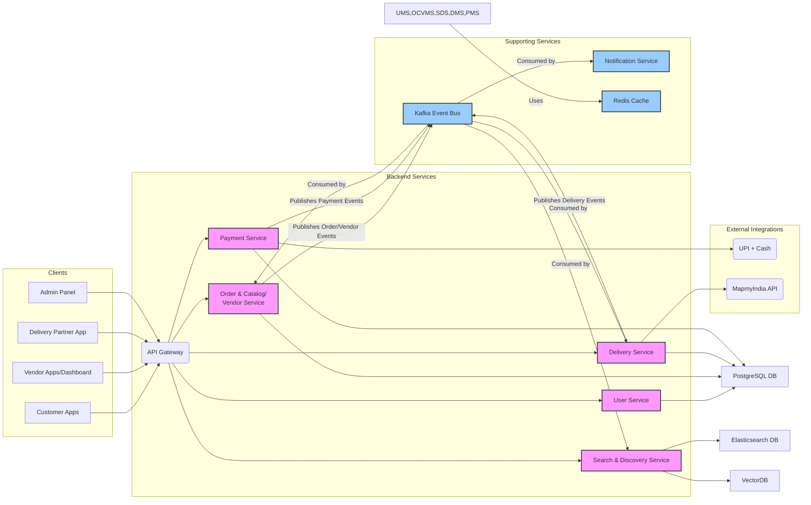
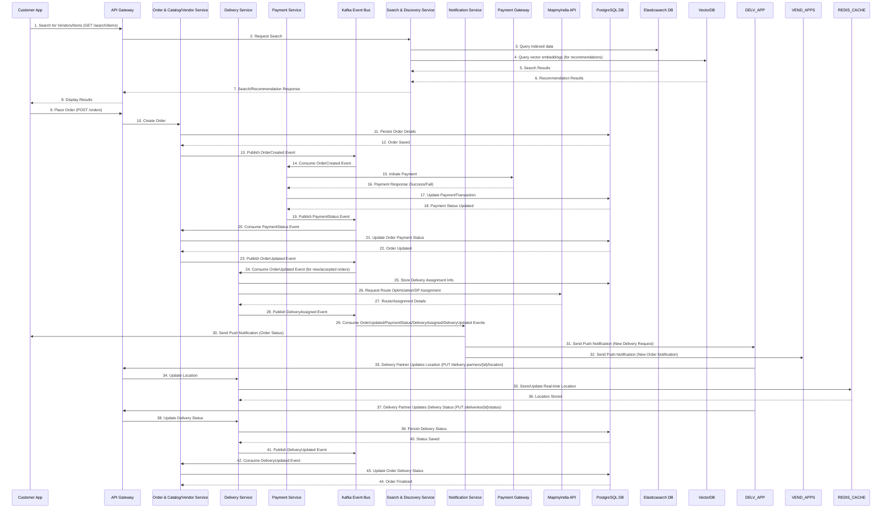

# Architecture Design Document: Tea & Snacks Delivery Aggregator

**Document Version:** 1.5 (Search Service Separated)
**Date:** July 27, 2025
**Prepared By:** BMAD Method

-----

## 1\. Introduction

This document outlines the overall project architecture for Tea & Snacks Delivery Aggregator, including backend systems, shared services, and non-UI specific concerns. Its primary goal is to serve as the guiding architectural blueprint for AI-driven development, ensuring consistency and adherence to chosen patterns and technologies.

**Relationship to Frontend Architecture:**
If the project includes a significant user interface, a separate Frontend Architecture Document will detail the frontend-specific design and MUST be used in conjunction with this document. Core technology stack choices documented herein (see "Tech Stack") are definitive for the entire project, including any frontend components.

### Starter Template or Existing Project

N/A

### Change Log

| Date | Version | Description | Author |
|---|---|---|---|
| July 27, 2025 | 1.0 | Initial architecture draft | BMAD Method |
| July 27, 2025 | 1.1 | Updated Mermaid diagram with abbreviations | BMAD Method |
| July 27, 2025 | 1.2 | Consolidated microservices into a modular monolith | BMAD Method |
| July 27, 2025 | 1.3 | Explicitly showed Elasticsearch and VectorDB interactions | BMAD Method |
| July 27, 2025 | 1.4 | Separated Search & Discovery Service as a distinct microservice | BMAD Method |
| July 27, 2025 | 1.5 | Final detailed architecture document based on template | BMAD Method |

## 2\. High Level Architecture

### Technical Summary

The Tea & Snacks Delivery Aggregator platform employs a hybrid architectural style, primarily a modular monolith with a dedicated microservice for Search & Discovery. This design focuses on balancing initial development simplicity with future scalability requirements, particularly for high-traffic search functionalities. Key components include client applications (mobile/web), an API Gateway, consolidated backend services (User, Order/Catalog/Vendor, Delivery, Payment), and a separate Search & Discovery Service. Communication is primarily synchronous via REST APIs, with Apache Kafka providing asynchronous event-driven communication for decoupling and data synchronization. PostgreSQL serves as the primary relational database, supplemented by Redis for caching, Elasticsearch for search indexing, and VectorDB for recommendations. The architecture supports diverse user segments, including specialized captive audiences, by integrating with location services and pre-order systems.

### High Level Overview

1.  **Main Architectural Style:** The system adopts a **Modular Monolith** approach for most core functionalities (User, Order, Catalog, Vendor, Delivery, Payment), promoting faster initial development and easier management. However, the **Search & Discovery Service** is architected as a distinct **Microservice** from the outset due to its specialized infrastructure needs, high query volume, and critical performance requirements. This hybrid approach offers a balance between initial simplicity and targeted scalability.
2.  **Repository Structure:** (Not explicitly defined in previous context, but implicitly assumed for a modular monolith) A **Monorepo** approach is suitable, where different logical modules/services (even if deployed together initially) reside within the same repository. This facilitates code sharing and consistent tooling.
3.  **Service Architecture:** As described above, it's a **Modular Monolith** for most core business domains, with an explicit **Microservice** for Search & Discovery.
4.  **Primary User Interaction Flow or Data Flow at a Conceptual Level:**
      * Clients (Customer Apps, Vendor Apps, Delivery App, Admin Panel) interact with the system via the API Gateway.
      * The API Gateway routes requests to the appropriate backend service (UMS, OCVMS, SDS, DMS, PMS).
      * Transactional data is primarily handled by PostgreSQL.
      * Changes in OCVMS, DMS, or PMS publish events to Kafka.
      * SDS and NOTIF\_SVC consume events from Kafka for indexing, recommendations, and real-time notifications.
      * Caching is utilized across services via Redis for performance.
      * DMS integrates with external mapping APIs, and PMS integrates with external payment gateways.
5.  **Key Architectural Decisions and their Rationale:**
      * **Modular Monolith + Dedicated Search Microservice:** This hybrid approach reduces initial complexity by consolidating related functionalities into larger modules while isolating the highly performant and infrastructure-intensive search capabilities. It allows for easier future decomposition of other modules if needed.
      * **API Gateway:** Provides a single, secure entry point, handling cross-cutting concerns like authentication, rate limiting, and request routing, simplifying client-side interactions.
      * **Event-Driven Communication (Kafka):** Decouples services, enables asynchronous processing, supports real-time data synchronization for search/notifications, and improves system resilience against failures.
      * **PostgreSQL as Primary DB:** A robust, feature-rich relational database suitable for core transactional data and maintaining data consistency.
      * **Elasticsearch & VectorDB for Search:** Specialized databases for highly efficient full-text search and advanced vector-based recommendations, crucial for user experience.
      * **Redis for Caching:** Significantly improves performance and reduces database load by caching frequently accessed data.

### High Level Project Diagram



### Architectural and Design Patterns

  - **Modular Monolith:** Start with a cohesive application structured into loosely coupled modules that can be extracted into separate microservices in the future. - *Rationale:* Reduces initial complexity and operational overhead while maintaining the flexibility to scale specific parts of the system as needed.
  - **Microservices (for Search & Discovery):** Decompose the highly specialized and frequently accessed search functionality into an independent service. - *Rationale:* Enables independent scaling, technology choice, and deployment for a critical, performance-sensitive component, ensuring it can handle high loads and specialized infrastructure.
  - **API Gateway Pattern:** Centralize API access for all client applications. - *Rationale:* Provides a single entry point, simplifies client-side code, and enables cross-cutting concerns (authentication, rate limiting) to be handled uniformly.
  - **Event-Driven Architecture (EDA):** Utilize a message broker for asynchronous communication between services. - *Rationale:* Decouples services, improves system responsiveness by offloading long-running tasks, facilitates data synchronization for search/notifications, and enhances overall system resilience.
  - **Database per Service (Logical Separation):** While initially using a single PostgreSQL instance, maintain logical separation of data concerns per module/service. - *Rationale:* Prepares for future physical database separation (e.g., sharding or dedicated DBs per microservice) if scalability demands it, without increasing initial operational complexity.
  - **Caching Pattern:** Employ an in-memory data store for frequently accessed data. - *Rationale:* Significantly reduces latency for read-heavy operations, decreases load on primary databases, and improves overall system performance.
  - **Repository Pattern:** Abstract data access logic from business logic within each service/module. - *Rationale:* Promotes testability, allows for easier migration to different data storage technologies, and enforces a clean separation of concerns.

## 3\. Tech Stack

This is the DEFINITIVE technology selection section.

### Cloud Infrastructure

  - **Provider:** AWS
  - **Key Services:** AWS API Gateway, AWS RDS (PostgreSQL), AWS ElastiCache (Redis), AWS MSK (Kafka), AWS EKS (Kubernetes), AWS S3, AWS CloudWatch, AWS X-Ray, AWS IAM, AWS WAF.
  - **Deployment Regions:** eu-west-1 (Ireland) or ap-south-1 (Mumbai, India) - *Recommendation: ap-south-1 for primary focus on India market, lower latency for India-based users.*

### Technology Stack Table

| Category | Technology | Version | Purpose | Rationale |
|---|---|---|---|---|
| **Language** | Java | 17 | Primary backend development language | Strong ecosystem, mature frameworks, good performance, widely adopted for enterprise systems. |
| **Runtime** | JVM | - | Java Virtual Machine | Standard runtime for Java applications, robust and well-optimized. |
| **Framework** | Spring Boot | 3.2.x | Backend service development | Rapid development, strong convention over configuration, extensive ecosystem of modules for various needs (JPA, Web, Kafka, Security). |
| **Web Framework** | Spring Web MVC | - | REST API development within Spring Boot | Integrated with Spring Boot, provides robust features for building RESTful services. |
| **ORM/Data Access** | Spring Data JPA (Hibernate) | - | Database interaction | Simplifies data access, object-relational mapping, reduces boilerplate code, supports transactions. |
| **Database** | PostgreSQL | 15.x | Primary transactional and relational data store | Robust, open-source, ACID compliant, excellent support for complex queries, high scalability, and active community. |
| **Caching** | Redis | 7.x | In-memory data store for caching and real-time data | High performance, supports various data structures (hash, list, set), ideal for session management, leaderboards, and frequently accessed data. |
| **Search Engine** | Elasticsearch | 8.x | Full-text search and analytical indexing for SDS | Distributed, highly scalable search and analytics engine, ideal for complex queries, real-time indexing, and high throughput. |
| **Vector Database** | Pgvector (PostgreSQL extension) / or specialized VectorDB | 0.5.x (pgvector) / Latest stable | Store and query vector embeddings for SDS | Efficiently handles vector similarity search for recommendation features, can be integrated with PostgreSQL initially for simplicity or a dedicated solution for scale. |
| **Message Broker** | Apache Kafka | 3.x | Asynchronous inter-service communication | High-throughput, fault-tolerant, scalable event streaming platform, crucial for event-driven architecture and data synchronization. |
| **External APIs (Mapping)** | MapmyIndia API | Latest | Geolocation, mapping, routing for DMS | Indian context, comprehensive mapping data for accurate delivery, route optimization. |
| **External APIs (Payments)** | UPI Gateway (e.g., Razorpay, PayU) | Latest | Payment processing for PMS | Widely adopted digital payment system in India, essential for user convenience. |
| **External APIs (Notifications)** | FCM, SendGrid, Gupshup (SMS/WhatsApp) | Latest | Push notifications, email, SMS, WhatsApp | Comprehensive notification channels to reach users effectively. |
| **Containerization** | Docker | Latest stable | Packaging services | Ensures consistent environments across development and deployment, simplifies dependency management. |
| **Orchestration** | Kubernetes (EKS) | 1.28.x | Container orchestration and management | Automates deployment, scaling, and management of containerized applications, enabling independent scaling of services. |
| **CI/CD** | Jenkins | Latest LTS | Continuous Integration/Continuous Deployment | Automates build, test, and deployment pipelines. |
| **Infrastructure as Code (IaC)** | Terraform | 1.x | Infrastructure provisioning | Declarative infrastructure management, enables repeatable and consistent environment setup. |
| **Monitoring** | Prometheus | Latest stable | Metrics collection | Open-source monitoring system with a powerful query language, ideal for collecting real-time metrics from services. |
| **Visualization/Alerting** | Grafana | Latest stable | Dashboarding and alerting | Integrates with Prometheus to visualize metrics and configure alerts for system health. |
| **Centralized Logging** | OpenObserver / ELK Stack | Latest stable | Log aggregation and analysis | Centralized platform for collecting, parsing, and analyzing logs from all services, crucial for debugging and operational insights. |
| **Distributed Tracing** | OpenTelemetry | Latest stable | End-to-end transaction tracing | Provides visibility into request flow across multiple services, essential for debugging distributed systems. |
| **Build Tool** | Gradle | 8.x | Build automation for Spring Boot projects | Flexible, high-performance build automation system, widely used for Java/Spring projects. |
| **Testing Frameworks** | JUnit 5, Mockito | Latest stable | Unit and integration testing | Standard testing framework for Java, enables robust test suite development. |
| **Security Framework** | Spring Security | - | Authentication and authorization | Comprehensive security framework integrated with Spring Boot, provides robust control over access. |

## 4\. Data Models

### User

**Purpose:** Stores information about all users of the platform, including customers, vendors, delivery partners, and administrators.

**Key Attributes:**

  - `user_id`: UUID - Primary identifier for the user.
  - `username`: String - Unique username for login.
  - `password_hash`: String - Hashed password for security.
  - `email`: String - User's email address, unique.
  - `phone_number`: String - User's phone number, unique.
  - `user_type`: Enum (CUSTOMER, VENDOR, DELIVERY\_PARTNER, ADMIN) - Role of the user on the platform.
  - `first_name`: String - User's first name.
  - `last_name`: String - User's last name.
  - `address`: JSONB - User's default delivery address (street, city, state, zip, lat, long).
  - `created_at`: Timestamp - Timestamp of user creation.
  - `updated_at`: Timestamp - Timestamp of last update.
  - `status`: Enum (ACTIVE, INACTIVE, SUSPENDED) - Account status.
  - `company_id`: UUID (Optional) - For B2B users, links to a company profile.
  - `internal_delivery_point`: String (Optional) - For B2B users, specific location within a factory/workshop.

**Relationships:**

  - One-to-many with `Order` (a user can place multiple orders).
  - One-to-one with `Vendor` (if user\_type is VENDOR).
  - One-to-one with `DeliveryPartner` (if user\_type is DELIVERY\_PARTNER).

### Vendor

**Purpose:** Stores information about tea and snack vendors on the platform.

**Key Attributes:**

  - `vendor_id`: UUID - Primary identifier for the vendor.
  - `user_id`: UUID - Foreign key to `User` table (links to vendor's user account).
  - `name`: String - Business name of the vendor.
  - `description`: Text - Brief description of the vendor/cuisine.
  - `address`: JSONB - Vendor's physical address (street, city, state, zip, lat, long).
  - `phone_number`: String - Vendor's contact phone number.
  - `email`: String - Vendor's contact email.
  - `rating`: Decimal - Average rating from customer reviews.
  - `status`: Enum (ACTIVE, INACTIVE, PENDING\_APPROVAL) - Vendor's operational status.
  - `operating_hours`: JSONB - Daily operating hours (e.g., [{day: "MON", open: "09:00", close: "18:00"}]).
  - `is_open`: Boolean - Real-time status if vendor is currently open.
  - `menu_version`: Integer - Incremented on menu updates, used for caching invalidation.
  - `created_at`: Timestamp - Timestamp of vendor creation.
  - `updated_at`: Timestamp - Timestamp of last update.

**Relationships:**

  - One-to-one with `User`.
  - One-to-many with `MenuItem` (a vendor has multiple menu items).
  - One-to-many with `Order` (a vendor receives multiple orders).

### MenuItem

**Purpose:** Stores details of individual tea and snack items offered by vendors.

**Key Attributes:**

  - `menu_item_id`: UUID - Primary identifier.
  - `vendor_id`: UUID - Foreign key to `Vendor` table.
  - `name`: String - Name of the item.
  - `description`: Text - Detailed description of the item.
  - `price`: Decimal - Price of the item.
  - `category`: String - Category of the item (e.g., "Tea", "Coffee", "Snacks", "Biscuits").
  - `image_url`: String (Optional) - URL to item image.
  - `is_available`: Boolean - Whether the item is currently available.
  - `preparation_time_minutes`: Integer - Estimated time to prepare.
  - `created_at`: Timestamp.
  - `updated_at`: Timestamp.

**Relationships:**

  - Many-to-one with `Vendor`.
  - Many-to-many with `Order` (via `OrderItem`).

### Order

**Purpose:** Tracks customer orders from creation to completion.

**Key Attributes:**

  - `order_id`: UUID - Primary identifier.
  - `customer_id`: UUID - Foreign key to `User` table (the customer).
  - `vendor_id`: UUID - Foreign key to `Vendor` table.
  - `delivery_partner_id`: UUID (Optional) - Foreign key to `DeliveryPartner` table.
  - `order_status`: Enum (PENDING, ACCEPTED, PREPARING, READY\_FOR\_PICKUP, ON\_THE\_WAY, DELIVERED, CANCELLED, REJECTED) - Current status of the order.
  - `total_amount`: Decimal - Total amount of the order.
  - `payment_status`: Enum (PENDING, PAID, FAILED, REFUNDED) - Payment status.
  - `delivery_address`: JSONB - Snapshot of the delivery address at time of order.
  - `ordered_at`: Timestamp - Time order was placed.
  - `estimated_delivery_time`: Timestamp (Optional) - Estimated time of delivery.
  - `delivered_at`: Timestamp (Optional) - Actual time of delivery.
  - `special_instructions`: Text (Optional) - Any specific notes from customer.
  - `train_number`: String (Optional) - For train deliveries.
  - `coach_number`: String (Optional) - For train deliveries.
  - `seat_number`: String (Optional) - For train deliveries.
  - `station_code`: String (Optional) - For train deliveries, the station for delivery.
  - `scheduled_arrival_time`: Timestamp (Optional) - For train/bus, estimated arrival at delivery point.
  - `bus_operator`: String (Optional) - For bus deliveries.
  - `bus_number`: String (Optional) - For bus deliveries.
  - `scheduled_stop_time`: Timestamp (Optional) - For bus deliveries, the estimated stop time.
  - `company_id`: UUID (Optional) - For B2B orders.
  - `internal_delivery_point`: String (Optional) - For B2B orders, specific location within factory.

**Relationships:**

  - Many-to-one with `User` (customer).
  - Many-to-one with `Vendor`.
  - Many-to-one with `DeliveryPartner`.
  - One-to-many with `OrderItem`.
  - One-to-one with `PaymentTransaction`.

### OrderItem

**Purpose:** Details individual items within an order.

**Key Attributes:**

  - `order_item_id`: UUID - Primary identifier.
  - `order_id`: UUID - Foreign key to `Order` table.
  - `menu_item_id`: UUID - Foreign key to `MenuItem` table.
  - `quantity`: Integer - Quantity of the item.
  - `price_at_order`: Decimal - Price of the item at the time of order (to handle price changes).
  - `notes`: Text (Optional) - Any specific notes for this item.

**Relationships:**

  - Many-to-one with `Order`.
  - Many-to-one with `MenuItem`.

### PaymentTransaction

**Purpose:** Records all payment attempts and their statuses.

**Key Attributes:**

  - `transaction_id`: UUID - Primary identifier.
  - `order_id`: UUID - Foreign key to `Order` table.
  - `payment_method`: Enum (UPI, CASH, CARD, WALLET) - Method used for payment.
  - `amount`: Decimal - Amount of the transaction.
  - `transaction_status`: Enum (PENDING, SUCCESS, FAILED, REFUNDED) - Status of the payment transaction.
  - `gateway_transaction_id`: String (Optional) - ID from the payment gateway.
  - `transaction_time`: Timestamp - Time of the transaction.
  - `refund_id`: UUID (Optional) - Link to a refund record if applicable.

**Relationships:**

  - One-to-one with `Order`.

### DeliveryPartner

**Purpose:** Manages information about delivery personnel.

**Key Attributes:**

  - `delivery_partner_id`: UUID - Primary identifier.
  - `user_id`: UUID - Foreign key to `User` table (links to delivery partner's user account).
  - `name`: String - Delivery partner's name.
  - `phone_number`: String - Delivery partner's contact number.
  - `email`: String - Delivery partner's email.
  - `vehicle_type`: Enum (BIKE, SCOOTER, BICYCLE, CAR) - Type of vehicle.
  - `current_location`: Point (latitude, longitude) - Real-time last known location.
  - `availability_status`: Enum (ONLINE, OFFLINE, ON\_DELIVERY) - Current availability.
  - `rating`: Decimal - Average rating from customers.
  - `created_at`: Timestamp.
  - `updated_at`: Timestamp.

**Relationships:**

  - One-to-one with `User`.
  - One-to-many with `Order` (an order is assigned to a delivery partner).

## 5\. Components

### API Gateway (API\_GW)

**Responsibility:** Single entry point for all client requests, routing, authentication, rate limiting, and caching.

**Key Interfaces:**

  - All public REST API endpoints exposed to client applications.
  - Internal routing interface to backend services.

**Dependencies:** UMS (for authentication/authorization), all backend services (OCVMS, SDS, DMS, PMS).

**Technology Stack:** AWS API Gateway

### User Management Service (UMS)

**Responsibility:** Manages user authentication, authorization, registration, profile management, and user roles.

**Key Interfaces:**

  - `POST /users/register` - User registration.
  - `POST /users/login` - User login, JWT generation.
  - `GET /users/{userId}` - Fetch user profile.
  - `PUT /users/{userId}` - Update user profile.
  - `GET /users/{userId}/roles` - Get user roles.

**Dependencies:** PG\_DB, REDIS\_CACHE (for sessions/tokens).

**Technology Stack:** Spring Boot (Java), Spring Data JPA, PostgreSQL, Spring Security, JWT.

### Order & Catalog/Vendor Service (OCVMS)

**Responsibility:** Manages the full order lifecycle, vendor profiles, menu items, and aggregates data for reporting.

**Key Interfaces:**

  - `POST /orders` - Create new order.
  - `GET /orders/{orderId}` - Fetch order details.
  - `PUT /orders/{orderId}/status` - Update order status (internal/vendor).
  - `POST /vendors` - Register new vendor.
  - `GET /vendors/{vendorId}` - Fetch vendor profile.
  - `PUT /vendors/{vendorId}/menu` - Update vendor menu.
  - `GET /menus/{vendorId}` - Get menu for a vendor.
  - `GET /reports/daily-sales` - Generate sales reports.

**Dependencies:** PG\_DB, KAFKA\_EB (publishes order/vendor events), REDIS\_CACHE (for menu caching, popular items).

**Technology Stack:** Spring Boot (Java), Spring Data JPA, PostgreSQL, Apache Kafka (Producer).

### Search & Discovery Service (SDS)

**Responsibility:** Provides highly efficient search, filtering, and recommendation capabilities for vendors and menu items.

**Key Interfaces:**

  - `GET /search/vendors` - Search vendors by name, location, cuisine.
  - `GET /search/items` - Search menu items by name, category, vendor.
  - `GET /recommendations/items/{userId}` - Personalized item recommendations.
  - `GET /recommendations/vendors/{userId}` - Personalized vendor recommendations.
  - Internal Kafka consumers for data synchronization.

**Dependencies:** KAFKA\_EB (consumes OCVMS events for indexing), ES\_DB, VEC\_DB, REDIS\_CACHE (for search result caching, popular queries).

**Technology Stack:** Spring Boot (Java), Elasticsearch client, VectorDB client, Apache Kafka (Consumer).

### Delivery Service (DMS)

**Responsibility:** Manages delivery partner assignments, real-time location tracking, route optimization, and delivery status updates.

**Key Interfaces:**

  - `POST /deliveries/assign` - Assign a delivery partner to an order (internal/vendor).
  - `GET /deliveries/{deliveryId}` - Fetch delivery details.
  - `PUT /deliveries/{deliveryId}/status` - Update delivery status (by delivery partner).
  - `PUT /delivery-partners/{partnerId}/location` - Update delivery partner's real-time location.
  - Internal Kafka consumer for new order events.

**Dependencies:** PG\_DB, MAP\_API, KAFKA\_EB (publishes delivery events, consumes order events), REDIS\_CACHE (for real-time location data).

**Technology Stack:** Spring Boot (Java), Spring Data JPA, PostgreSQL, MapmyIndia API client, Apache Kafka (Producer/Consumer).

### Payment Service (PMS)

**Responsibility:** Handles payment processing, integrations with payment gateways, refunds, and transaction records.

**Key Interfaces:**

  - `POST /payments/process` - Initiate a payment for an order.
  - `GET /payments/{transactionId}` - Fetch transaction details.
  - `POST /payments/{transactionId}/refund` - Initiate a refund.
  - Internal Kafka consumer for order events (to know when payment is due).

**Dependencies:** PG\_DB, PGW, KAFKA\_EB (publishes payment events).

**Technology Stack:** Spring Boot (Java), Spring Data JPA, PostgreSQL, UPI Gateway SDKs, Apache Kafka (Producer).

### Notification Service (NOTIF\_SVC)

**Responsibility:** Sends real-time notifications (push, SMS, email, WhatsApp) based on system events.

**Key Interfaces:**

  - Internal Kafka consumers for all relevant events (order status, delivery updates, payment status).
  - Integrates with external notification providers.

**Dependencies:** KAFKA\_EB (consumes events), FCM, SendGrid, Gupshup.

**Technology Stack:** Spring Boot (Java), Kafka Consumer, FCM SDK, SendGrid SDK, Gupshup SDK.

### Component Diagrams


## 6\. External APIs

### MapmyIndia API

  - **Purpose:** Provides mapping, geolocation, and routing services for delivery management.
  - **Documentation:** (To be provided by user or found via search)
  - **Base URL(s):** `https://apis.mapmyindia.com`
  - **Authentication:** API Key (via headers or query parameters).
  - **Rate Limits:** Depends on subscription plan (e.g., QPM/RPM).

**Key Endpoints Used:**

  - `GET /v3/places/geocode` - Geocoding addresses to coordinates.
  - `GET /v3/places/nearby` - Finding nearby points of interest (e.g., vendors, delivery partners).
  - `GET /v3/routes` - Calculating optimal delivery routes.
  - `GET /v3/directions` - Providing turn-by-turn navigation.

**Integration Notes:** Implement retries with exponential backoff for transient errors. Cache frequently accessed static map data where permissible. Monitor usage against rate limits.

### UPI Payment Gateway (e.g., Razorpay, PayU) API

  - **Purpose:** Facilitates UPI-based payments, transaction management, and refunds.
  - **Documentation:** (Specific to chosen provider, e.g., Razorpay API Docs)
  - **Base URL(s):** (Specific to chosen provider, e.g., `https://api.razorpay.com/v1`)
  - **Authentication:** API Key and Secret (Basic Auth or OAuth).
  - **Rate Limits:** Depends on provider and account tier.

**Key Endpoints Used:**

  - `POST /orders` - Create a payment order.
  - `GET /payments/{payment_id}` - Fetch payment status.
  - `POST /payments/{payment_id}/capture` - Capture authorized payment.
  - `POST /refunds` - Initiate a refund.

**Integration Notes:** Ensure secure handling of API keys. Implement webhooks for real-time payment status updates. Handle idempotency for payment creation and capture to prevent duplicate transactions.

### Firebase Cloud Messaging (FCM) API

  - **Purpose:** Send push notifications to customer and delivery partner mobile applications.
  - **Documentation:** [https://firebase.google.com/docs/cloud-messaging](https://firebase.google.com/docs/cloud-messaging)
  - **Base URL(s):** `https://fcm.googleapis.com/v1/projects/{project-id}/messages:send`
  - **Authentication:** OAuth 2.0 with service account keys.
  - **Rate Limits:** High, but monitor for bursts.

**Key Endpoints Used:**

  - `POST /v1/projects/{project-id}/messages:send` - Send a message to a specific device or topic.

**Integration Notes:** Manage FCM device tokens securely. Implement topics for broadcasting notifications to groups (e.g., all delivery partners). Handle token expiration and invalidation.

### SendGrid API

  - **Purpose:** Send transactional emails (e.g., order confirmations, status updates).
  - **Documentation:** [https://docs.sendgrid.com/api-reference/](https://docs.sendgrid.com/api-reference/)
  - **Base URL(s):** `https://api.sendgrid.com/v3`
  - **Authentication:** API Key.
  - **Rate Limits:** Based on plan.

**Key Endpoints Used:**

  - `POST /mail/send` - Send emails.

**Integration Notes:** Use templates for common email types. Monitor delivery rates and bounces.

### Gupshup API

  - **Purpose:** Send SMS and WhatsApp messages for notifications.
  - **Documentation:** [https://www.gupshup.io/docs](https://www.gupshup.io/docs)
  - **Base URL(s):** `https://api.gupshup.io/sm/api/v1/msg`
  - **Authentication:** API Key/Basic Auth.
  - **Rate Limits:** Specific to account plan.

**Key Endpoints Used:**

  - `POST /sm/api/v1/msg` - Send SMS/WhatsApp messages.

**Integration Notes:** Ensure compliance with local messaging regulations. Manage message templates effectively.

## 7\. Core Workflows



## 8\. REST API Spec

```yaml
openapi: 3.0.0
info:
  title: Tea & Snacks Delivery Aggregator API
  version: 1.0.0
  description: API for managing users, orders, vendors, delivery, payments, and search for the Tea & Snacks Delivery Aggregator platform.
servers:
  - url: https://api.teasansnacks.com/v1
    description: Production Server
  - url: https://dev.teasansnacks.com/v1
    description: Development Server
tags:
  - name: Users
    description: User management operations
  - name: Auth
    description: Authentication operations
  - name: Orders
    description: Order management operations
  - name: Vendors
    description: Vendor management operations
  - name: Menu
    description: Menu item operations
  - name: Delivery
    description: Delivery operations
  - name: Payments
    description: Payment processing operations
  - name: Search
    description: Search and discovery operations
paths:
  /auth/register:
    post:
      summary: Register a new user
      tags:
        - Auth
      requestBody:
        required: true
        content:
          application/json:
            schema:
              $ref: '#/components/schemas/RegisterRequest'
      responses:
        '201':
          description: User registered successfully
          content:
            application/json:
              schema:
                $ref: '#/components/schemas/AuthResponse'
        '400':
          description: Invalid input
  /auth/login:
    post:
      summary: User login
      tags:
        - Auth
      requestBody:
        required: true
        content:
          application/json:
            schema:
              $ref: '#/components/schemas/LoginRequest'
      responses:
        '200':
          description: Login successful
          content:
            application/json:
              schema:
                $ref: '#/components/schemas/AuthResponse'
        '401':
          description: Invalid credentials
  /users/{userId}:
    get:
      summary: Get user profile by ID
      tags:
        - Users
      parameters:
        - in: path
          name: userId
          schema:
            type: string
            format: uuid
          required: true
          description: ID of the user to retrieve
      security:
        - bearerAuth: []
      responses:
        '200':
          description: User profile retrieved successfully
          content:
            application/json:
              schema:
                $ref: '#/components/schemas/User'
        '404':
          description: User not found
  /vendors:
    post:
      summary: Register a new vendor
      tags:
        - Vendors
      security:
        - bearerAuth: []
      requestBody:
        required: true
        content:
          application/json:
            schema:
              $ref: '#/components/schemas/VendorRegisterRequest'
      responses:
        '201':
          description: Vendor registered successfully
          content:
            application/json:
              schema:
                $ref: '#/components/schemas/Vendor'
  /vendors/{vendorId}/menu:
    put:
      summary: Update a vendor's menu
      tags:
        - Menu
        - Vendors
      parameters:
        - in: path
          name: vendorId
          schema:
            type: string
            format: uuid
          required: true
          description: ID of the vendor
      security:
        - bearerAuth: []
      requestBody:
        required: true
        content:
          application/json:
            schema:
              type: array
              items:
                $ref: '#/components/schemas/MenuItemRequest'
      responses:
        '200':
          description: Menu updated successfully
          content:
            application/json:
              schema:
                type: array
                items:
                  $ref: '#/components/schemas/MenuItem'
  /orders:
    post:
      summary: Place a new order
      tags:
        - Orders
      security:
        - bearerAuth: []
      requestBody:
        required: true
        content:
          application/json:
            schema:
              $ref: '#/components/schemas/OrderCreateRequest'
      responses:
        '201':
          description: Order placed successfully
          content:
            application/json:
              schema:
                $ref: '#/components/schemas/Order'
  /orders/{orderId}/status:
    put:
      summary: Update order status (Vendor/Admin/Delivery Partner)
      tags:
        - Orders
      parameters:
        - in: path
          name: orderId
          schema:
            type: string
            format: uuid
          required: true
          description: ID of the order
      security:
        - bearerAuth: []
      requestBody:
        required: true
        content:
          application/json:
            schema:
              $ref: '#/components/schemas/OrderStatusUpdateRequest'
      responses:
        '200':
          description: Order status updated
  /payments/process:
    post:
      summary: Initiate payment for an order
      tags:
        - Payments
      security:
        - bearerAuth: []
      requestBody:
        required: true
        content:
          application/json:
            schema:
              $ref: '#/components/schemas/PaymentInitiateRequest'
      responses:
        '200':
          description: Payment initiated successfully
          content:
            application/json:
              schema:
                $ref: '#/components/schemas/PaymentResponse'
  /search/vendors:
    get:
      summary: Search for vendors
      tags:
        - Search
      parameters:
        - in: query
          name: q
          schema:
            type: string
          description: Search query for vendor name/description
        - in: query
          name: latitude
          schema:
            type: number
            format: float
          description: Latitude for proximity search
        - in: query
          name: longitude
          schema:
            type: number
            format: float
          description: Longitude for proximity search
        - in: query
          name: radius
          schema:
            type: number
            format: float
            default: 5
          description: Search radius in kilometers
        - in: query
          name: category
          schema:
            type: string
          description: Filter by menu item category
        - in: query
          name: minRating
          schema:
            type: number
            format: float
            minimum: 0
            maximum: 5
          description: Minimum average rating
      responses:
        '200':
          description: List of vendors matching criteria
          content:
            application/json:
              schema:
                type: array
                items:
                  $ref: '#/components/schemas/VendorSearchResponse'
  /search/items:
    get:
      summary: Search for menu items
      tags:
        - Search
      parameters:
        - in: query
          name: q
          schema:
            type: string
          description: Search query for item name/description
        - in: query
          name: vendorId
          schema:
            type: string
            format: uuid
          description: Filter by specific vendor
        - in: query
          name: category
          schema:
            type: string
          description: Filter by item category
        - in: query
          name: maxPrice
          schema:
            type: number
            format: float
          description: Maximum price
      responses:
        '200':
          description: List of menu items matching criteria
          content:
            application/json:
              schema:
                type: array
                items:
                  $ref: '#/components/schemas/MenuItemSearchResponse'
  /recommendations/items/{userId}:
    get:
      summary: Get recommended menu items for a user
      tags:
        - Search
      parameters:
        - in: path
          name: userId
          schema:
            type: string
            format: uuid
          required: true
          description: ID of the user for recommendations
      security:
        - bearerAuth: []
      responses:
        '200':
          description: List of recommended menu items
          content:
            application/json:
              schema:
                type: array
                items:
                  $ref: '#/components/schemas/MenuItemSearchResponse'
  /delivery-partners/{partnerId}/location:
    put:
      summary: Update delivery partner's real-time location
      tags:
        - Delivery
      parameters:
        - in: path
          name: partnerId
          schema:
            type: string
            format: uuid
          required: true
          description: ID of the delivery partner
      security:
        - bearerAuth: []
      requestBody:
        required: true
        content:
          application/json:
            schema:
              $ref: '#/components/schemas/LocationUpdate'
      responses:
        '200':
          description: Location updated successfully
  /deliveries/{deliveryId}/status:
    put:
      summary: Update delivery status by delivery partner
      tags:
        - Delivery
      parameters:
        - in: path
          name: deliveryId
          schema:
            type: string
            format: uuid
          required: true
          description: ID of the delivery
      security:
        - bearerAuth: []
      requestBody:
        required: true
        content:
          application/json:
            schema:
              type: object
              properties:
                status:
                  type: string
                  enum: [PICKED_UP, ON_THE_WAY, DELIVERED, FAILED_DELIVERY]
              required:
                - status
      responses:
        '200':
          description: Delivery status updated
components:
  securitySchemes:
    bearerAuth:
      type: http
      scheme: bearer
      bearerFormat: JWT
  schemas:
    Address:
      type: object
      properties:
        street:
          type: string
        city:
          type: string
        state:
          type: string
        zip_code:
          type: string
        latitude:
          type: number
          format: float
        longitude:
          type: number
          format: float
    RegisterRequest:
      type: object
      properties:
        username:
          type: string
        password:
          type: string
        email:
          type: string
        phone_number:
          type: string
        user_type:
          type: string
          enum: [CUSTOMER, VENDOR, DELIVERY_PARTNER]
      required:
        - username
        - password
        - email
        - phone_number
        - user_type
    LoginRequest:
      type: object
      properties:
        username:
          type: string
        password:
          type: string
      required:
        - username
        - password
    AuthResponse:
      type: object
      properties:
        access_token:
          type: string
        token_type:
          type: string
          default: Bearer
        expires_in:
          type: integer
    User:
      type: object
      properties:
        user_id:
          type: string
          format: uuid
        username:
          type: string
        email:
          type: string
        phone_number:
          type: string
        user_type:
          type: string
          enum: [CUSTOMER, VENDOR, DELIVERY_PARTNER, ADMIN]
        first_name:
          type: string
        last_name:
          type: string
        address:
          $ref: '#/components/schemas/Address'
        created_at:
          type: string
          format: date-time
        updated_at:
          type: string
          format: date-time
        status:
          type: string
          enum: [ACTIVE, INACTIVE, SUSPENDED]
        company_id:
          type: string
          format: uuid
        internal_delivery_point:
          type: string
    VendorRegisterRequest:
      type: object
      properties:
        name:
          type: string
        description:
          type: string
        address:
          $ref: '#/components/schemas/Address'
        phone_number:
          type: string
        email:
          type: string
        user_id:
          type: string
          format: uuid
      required:
        - name
        - address
        - phone_number
        - email
        - user_id
    Vendor:
      type: object
      properties:
        vendor_id:
          type: string
          format: uuid
        user_id:
          type: string
          format: uuid
        name:
          type: string
        description:
          type: string
        address:
          $ref: '#/components/schemas/Address'
        phone_number:
          type: string
        email:
          type: string
        rating:
          type: number
          format: float
        status:
          type: string
          enum: [ACTIVE, INACTIVE, PENDING_APPROVAL]
        operating_hours:
          type: array
          items:
            type: object
            properties:
              day:
                type: string
              open:
                type: string
                pattern: "^([01]\\d|2[0-3]):([0-5]\\d)$"
              close:
                type: string
                pattern: "^([01]\\d|2[0-3]):([0-5]\\d)$"
        is_open:
          type: boolean
        created_at:
          type: string
          format: date-time
        updated_at:
          type: string
          format: date-time
    MenuItemRequest:
      type: object
      properties:
        name:
          type: string
        description:
          type: string
        price:
          type: number
          format: float
        category:
          type: string
        image_url:
          type: string
          format: url
        is_available:
          type: boolean
        preparation_time_minutes:
          type: integer
      required:
        - name
        - price
        - category
        - is_available
    MenuItem:
      type: object
      properties:
        menu_item_id:
          type: string
          format: uuid
        vendor_id:
          type: string
          format: uuid
        name:
          type: string
        description:
          type: string
        price:
          type: number
          format: float
        category:
          type: string
        image_url:
          type: string
          format: url
        is_available:
          type: boolean
        preparation_time_minutes:
          type: integer
        created_at:
          type: string
          format: date-time
        updated_at:
          type: string
          format: date-time
    OrderItemRequest:
      type: object
      properties:
        menu_item_id:
          type: string
          format: uuid
        quantity:
          type: integer
          minimum: 1
        notes:
          type: string
      required:
        - menu_item_id
        - quantity
    OrderCreateRequest:
      type: object
      properties:
        vendor_id:
          type: string
          format: uuid
        items:
          type: array
          items:
            $ref: '#/components/schemas/OrderItemRequest'
        delivery_address:
          $ref: '#/components/schemas/Address'
        special_instructions:
          type: string
        train_number:
          type: string
        coach_number:
          type: string
        seat_number:
          type: string
        station_code:
          type: string
        scheduled_arrival_time:
          type: string
          format: date-time
        bus_operator:
          type: string
        bus_number:
          type: string
        scheduled_stop_time:
          type: string
          format: date-time
        company_id:
          type: string
          format: uuid
        internal_delivery_point:
          type: string
      required:
        - vendor_id
        - items
        - delivery_address
    Order:
      type: object
      properties:
        order_id:
          type: string
          format: uuid
        customer_id:
          type: string
          format: uuid
        vendor_id:
          type: string
          format: uuid
        delivery_partner_id:
          type: string
          format: uuid
        order_status:
          type: string
          enum: [PENDING, ACCEPTED, PREPARING, READY_FOR_PICKUP, ON_THE_WAY, DELIVERED, CANCELLED, REJECTED]
        total_amount:
          type: number
          format: float
        payment_status:
          type: string
          enum: [PENDING, PAID, FAILED, REFUNDED]
        delivery_address:
          $ref: '#/components/schemas/Address'
        ordered_at:
          type: string
          format: date-time
        estimated_delivery_time:
          type: string
          format: date-time
        delivered_at:
          type: string
          format: date-time
        special_instructions:
          type: string
        train_number:
          type: string
        coach_number:
          type: string
        seat_number:
          type: string
        station_code:
          type: string
        scheduled_arrival_time:
          type: string
          format: date-time
        bus_operator:
          type: string
        bus_number:
          type: string
        scheduled_stop_time:
          type: string
          format: date-time
        company_id:
          type: string
          format: uuid
        internal_delivery_point:
          type: string
        items:
          type: array
          items:
            $ref: '#/components/schemas/OrderItem'
    OrderItem:
      type: object
      properties:
        order_item_id:
          type: string
          format: uuid
        order_id:
          type: string
          format: uuid
        menu_item_id:
          type: string
          format: uuid
        quantity:
          type: integer
        price_at_order:
          type: number
          format: float
        notes:
          type: string
    OrderStatusUpdateRequest:
      type: object
      properties:
        status:
          type: string
          enum: [ACCEPTED, REJECTED, PREPARING, READY_FOR_PICKUP, ON_THE_WAY, DELIVERED, CANCELLED]
        delivery_partner_id:
          type: string
          format: uuid
          description: Only applicable when status transitions to ON_THE_WAY and assigned to DP
      required:
        - status
    PaymentInitiateRequest:
      type: object
      properties:
        order_id:
          type: string
          format: uuid
        payment_method:
          type: string
          enum: [UPI, CASH] # Card/Wallet can be added later
      required:
        - order_id
        - payment_method
    PaymentResponse:
      type: object
      properties:
        transaction_id:
          type: string
          format: uuid
        order_id:
          type: string
          format: uuid
        status:
          type: string
          enum: [PENDING, SUCCESS, FAILED]
        amount:
          type: number
          format: float
        redirect_url:
          type: string
          format: url
          description: For UPI redirects
    VendorSearchResponse:
      type: object
      properties:
        vendor_id:
          type: string
          format: uuid
        name:
          type: string
        description:
          type: string
        address:
          $ref: '#/components/schemas/Address'
        rating:
          type: number
          format: float
        is_open:
          type: boolean
        distance_km:
          type: number
          format: float
    MenuItemSearchResponse:
      type: object
      properties:
        menu_item_id:
          type: string
          format: uuid
        vendor_id:
          type: string
          format: uuid
        vendor_name:
          type: string
        name:
          type: string
        description:
          type: string
        price:
          type: number
          format: float
        category:
          type: string
        image_url:
          type: string
          format: url
        is_available:
          type: boolean
        preparation_time_minutes:
          type: integer
    LocationUpdate:
      type: object
      properties:
        latitude:
          type: number
          format: float
        longitude:
          type: number
          format: float
      required:
        - latitude
        - longitude
```

## 9\. Database Schema

For PostgreSQL, we will use standard SQL DDL. Elasticsearch and VectorDB will manage their own indexing/vector stores, populated via Kafka consumers from PostgreSQL data changes.

```sql
-- Schema for User Management Service (UMS)
CREATE TABLE users (
    user_id UUID PRIMARY KEY,
    username VARCHAR(255) UNIQUE NOT NULL,
    password_hash VARCHAR(255) NOT NULL,
    email VARCHAR(255) UNIQUE NOT NULL,
    phone_number VARCHAR(20) UNIQUE NOT NULL,
    user_type VARCHAR(50) NOT NULL, -- 'CUSTOMER', 'VENDOR', 'DELIVERY_PARTNER', 'ADMIN'
    first_name VARCHAR(255),
    last_name VARCHAR(255),
    address JSONB, -- Stores street, city, state, zip, lat, long
    created_at TIMESTAMP WITH TIME ZONE DEFAULT CURRENT_TIMESTAMP,
    updated_at TIMESTAMP WITH TIME ZONE DEFAULT CURRENT_TIMESTAMP,
    status VARCHAR(50) DEFAULT 'ACTIVE', -- 'ACTIVE', 'INACTIVE', 'SUSPENDED'
    company_id UUID, -- For B2B integration
    internal_delivery_point VARCHAR(255) -- For B2B integration
);

CREATE INDEX idx_users_email ON users (email);
CREATE INDEX idx_users_phone ON users (phone_number);
CREATE INDEX idx_users_user_type ON users (user_type);
CREATE INDEX idx_users_company_id ON users (company_id);

-- Schema for Order & Catalog/Vendor Service (OCVMS)
CREATE TABLE vendors (
    vendor_id UUID PRIMARY KEY,
    user_id UUID UNIQUE NOT NULL REFERENCES users(user_id), -- Link to user account for login
    name VARCHAR(255) NOT NULL,
    description TEXT,
    address JSONB NOT NULL, -- Stores street, city, state, zip, lat, long
    phone_number VARCHAR(20),
    email VARCHAR(255),
    rating DECIMAL(2,1) DEFAULT 0.0,
    status VARCHAR(50) DEFAULT 'PENDING_APPROVAL', -- 'ACTIVE', 'INACTIVE', 'PENDING_APPROVAL'
    operating_hours JSONB, -- Array of objects: [{day: "MON", open: "09:00", close: "18:00"}]
    is_open BOOLEAN DEFAULT FALSE,
    menu_version INTEGER DEFAULT 1,
    created_at TIMESTAMP WITH TIME ZONE DEFAULT CURRENT_TIMESTAMP,
    updated_at TIMESTAMP WITH TIME ZONE DEFAULT CURRENT_TIMESTAMP
);

CREATE INDEX idx_vendors_user_id ON vendors (user_id);
CREATE INDEX idx_vendors_name ON vendors (name);
CREATE INDEX idx_vendors_status ON vendors (status);
CREATE INDEX idx_vendors_location ON vendors USING GIST (CAST(address->>'latitude' AS DOUBLE PRECISION), CAST(address->>'longitude' AS DOUBLE PRECISION)); -- Requires PostGIS for spatial indexing

CREATE TABLE menu_items (
    menu_item_id UUID PRIMARY KEY,
    vendor_id UUID NOT NULL REFERENCES vendors(vendor_id),
    name VARCHAR(255) NOT NULL,
    description TEXT,
    price DECIMAL(10,2) NOT NULL,
    category VARCHAR(100) NOT NULL,
    image_url VARCHAR(500),
    is_available BOOLEAN DEFAULT TRUE,
    preparation_time_minutes INTEGER,
    created_at TIMESTAMP WITH TIME ZONE DEFAULT CURRENT_TIMESTAMP,
    updated_at TIMESTAMP WITH TIME ZONE DEFAULT CURRENT_TIMESTAMP
);

CREATE INDEX idx_menu_items_vendor_id ON menu_items (vendor_id);
CREATE INDEX idx_menu_items_name ON menu_items (name);
CREATE INDEX idx_menu_items_category ON menu_items (category);

CREATE TABLE orders (
    order_id UUID PRIMARY KEY,
    customer_id UUID NOT NULL REFERENCES users(user_id),
    vendor_id UUID NOT NULL REFERENCES vendors(vendor_id),
    delivery_partner_id UUID REFERENCES users(user_id), -- Optional, assigned by DMS
    order_status VARCHAR(50) NOT NULL, -- 'PENDING', 'ACCEPTED', 'PREPARING', 'READY_FOR_PICKUP', 'ON_THE_WAY', 'DELIVERED', 'CANCELLED', 'REJECTED'
    total_amount DECIMAL(10,2) NOT NULL,
    payment_status VARCHAR(50) NOT NULL, -- 'PENDING', 'PAID', 'FAILED', 'REFUNDED'
    delivery_address JSONB NOT NULL, -- Snapshot of address at time of order
    ordered_at TIMESTAMP WITH TIME ZONE DEFAULT CURRENT_TIMESTAMP,
    estimated_delivery_time TIMESTAMP WITH TIME ZONE,
    delivered_at TIMESTAMP WITH TIME ZONE,
    special_instructions TEXT,
    train_number VARCHAR(50),
    coach_number VARCHAR(50),
    seat_number VARCHAR(50),
    station_code VARCHAR(50),
    scheduled_arrival_time TIMESTAMP WITH TIME ZONE,
    bus_operator VARCHAR(100),
    bus_number VARCHAR(50),
    scheduled_stop_time TIMESTAMP WITH TIME ZONE,
    company_id UUID, -- For B2B orders
    internal_delivery_point VARCHAR(255) -- For B2B orders
);

CREATE INDEX idx_orders_customer_id ON orders (customer_id);
CREATE INDEX idx_orders_vendor_id ON orders (vendor_id);
CREATE INDEX idx_orders_delivery_partner_id ON orders (delivery_partner_id);
CREATE INDEX idx_orders_status ON orders (order_status);
CREATE INDEX idx_orders_ordered_at ON orders (ordered_at);
CREATE INDEX idx_orders_station_code ON orders (station_code);
CREATE INDEX idx_orders_company_id ON orders (company_id);

CREATE TABLE order_items (
    order_item_id UUID PRIMARY KEY,
    order_id UUID NOT NULL REFERENCES orders(order_id),
    menu_item_id UUID NOT NULL REFERENCES menu_items(menu_item_id),
    quantity INTEGER NOT NULL,
    price_at_order DECIMAL(10,2) NOT NULL,
    notes TEXT,
    CONSTRAINT unique_order_item UNIQUE (order_id, menu_item_id) -- Ensures only one entry per item per order
);

CREATE INDEX idx_order_items_order_id ON order_items (order_id);
CREATE INDEX idx_order_items_menu_item_id ON order_items (menu_item_id);

-- Schema for Payment Service (PMS)
CREATE TABLE payment_transactions (
    transaction_id UUID PRIMARY KEY,
    order_id UUID UNIQUE NOT NULL REFERENCES orders(order_id), -- One-to-one with order
    payment_method VARCHAR(50) NOT NULL, -- 'UPI', 'CASH', 'CARD', 'WALLET'
    amount DECIMAL(10,2) NOT NULL,
    transaction_status VARCHAR(50) NOT NULL, -- 'PENDING', 'SUCCESS', 'FAILED', 'REFUNDED'
    gateway_transaction_id VARCHAR(255),
    transaction_time TIMESTAMP WITH TIME ZONE DEFAULT CURRENT_TIMESTAMP,
    refund_id UUID -- Link to refund record if applicable
);

CREATE INDEX idx_payment_transactions_order_id ON payment_transactions (order_id);
CREATE INDEX idx_payment_transactions_status ON payment_transactions (transaction_status);

-- Schema for Delivery Service (DMS) - Delivery Partner Details (assuming delivery partner user_type in 'users' table)
-- This table specifically holds delivery-partner related attributes, distinct from their user login info.
CREATE TABLE delivery_partners (
    delivery_partner_id UUID PRIMARY KEY,
    user_id UUID UNIQUE NOT NULL REFERENCES users(user_id), -- Link to user account for login
    vehicle_type VARCHAR(50) NOT NULL, -- 'BIKE', 'SCOOTER', 'BICYCLE', 'CAR'
    current_location POINT, -- Stores (longitude, latitude) - requires PostGIS `point` type
    availability_status VARCHAR(50) DEFAULT 'OFFLINE', -- 'ONLINE', 'OFFLINE', 'ON_DELIVERY'
    rating DECIMAL(2,1) DEFAULT 0.0,
    created_at TIMESTAMP WITH TIME ZONE DEFAULT CURRENT_TIMESTAMP,
    updated_at TIMESTAMP WITH TIME ZONE DEFAULT CURRENT_TIMESTAMP
);

CREATE INDEX idx_delivery_partners_user_id ON delivery_partners (user_id);
CREATE INDEX idx_delivery_partners_status ON delivery_partners (availability_status);
CREATE INDEX idx_delivery_partners_location ON delivery_partners USING GIST (current_location); -- Requires PostGIS for spatial indexing

-- Note: SDS will use Elasticsearch and VectorDB primarily. Data will be denormalized and indexed from PostgreSQL via Kafka events.
-- Elasticsearch Index (conceptual, actual mapping defined in SDS service code):
-- Index: vendors_index
-- Fields: vendor_id, name, description, address.latitude, address.longitude, rating, is_open, category (from menu items)
--
-- Index: menu_items_index
-- Fields: menu_item_id, vendor_id, vendor_name, name, description, price, category, is_available, preparation_time_minutes
--
-- VectorDB (conceptual, actual schema depends on chosen VectorDB):
-- Collection: item_embeddings
-- Fields: menu_item_id, embedding (vector array), metadata (e.g., category, vendor_id)
--
-- Collection: user_embeddings (for personalized recommendations)
-- Fields: user_id, embedding (vector array), metadata
```

## 10\. Source Tree

```plaintext
project-root/
├── docs/                               # Architecture, PRD, other documentation
│   └── architecture.md
│   └── prd.md
├── services/
│   ├── api-gateway/                    # API Gateway configuration (e.g., AWS Lambda proxies, OpenAPI spec)
│   │   ├── src/
│   │   └── serverless.yml/cloudformation.yml
│   ├── user-service/                   # User Management Service (UMS)
│   │   ├── src/main/java/com/tsda/ums/
│   │   │   ├── controller/
│   │   │   ├── service/
│   │   │   ├── repository/
│   │   │   └── model/
│   │   ├── build.gradle
│   │   └── Dockerfile
│   ├── order-catalog-vendor-service/   # Consolidated OCVMS
│   │   ├── src/main/java/com/tsda/ocvms/
│   │   │   ├── order/                  # Module for Order management
│   │   │   │   ├── controller/
│   │   │   │   ├── service/
│   │   │   │   ├── repository/
│   │   │   │   └── model/
│   │   │   ├── catalog/                # Module for Catalog/Menu management
│   │   │   ├── vendor/                 # Module for Vendor management
│   │   │   ├── reporting/              # Module for Reporting
│   │   │   └── config/
│   │   ├── build.gradle
│   │   └── Dockerfile
│   ├── search-discovery-service/       # Dedicated Search & Discovery Service (SDS)
│   │   ├── src/main/java/com/tsda/sds/
│   │   │   ├── controller/
│   │   │   ├── service/
│   │   │   ├── repository/             # Handles interaction with ES/VectorDB
│   │   │   ├── model/
│   │   │   └── kafka/                  # Kafka Consumers for indexing
│   │   ├── build.gradle
│   │   └── Dockerfile
│   ├── delivery-service/               # Delivery Service (DMS)
│   │   ├── src/main/java/com/tsda/dms/
│   │   │   ├── controller/
│   │   │   ├── service/
│   │   │   ├── repository/
│   │   │   ├── model/
│   │   │   └── external/               # MapmyIndia API client
│   │   ├── build.gradle
│   │   └── Dockerfile
│   ├── payment-service/                # Payment Service (PMS)
│   │   ├── src/main/java/com/tsda/pms/
│   │   │   ├── controller/
│   │   │   ├── service/
│   │   │   ├── repository/
│   │   │   ├── model/
│   │   │   └── gateway/                # UPI Gateway clients
│   │   ├── build.gradle
│   │   └── Dockerfile
│   └── notification-service/           # Notification Service (NOTIF_SVC)
│       ├── src/main/java/com/tsda/notifications/
│       │   ├── service/
│       │   ├── kafka/                  # Kafka Consumers for events
│       │   └── providers/              # FCM, SendGrid, Gupshup clients
│       ├── build.gradle
│       └── Dockerfile
├── shared/                             # Shared libraries, DTOs, enums, exceptions across services
│   ├── java/
│   │   └── com/tsda/shared/
│   │       ├── dto/
│   │       ├── enums/
│   │       └── exceptions/
│   ├── build.gradle
│   └── pom.xml (for shared dependencies)
├── infrastructure/                     # Terraform configurations
│   ├── environments/
│   │   ├── dev/
│   │   ├── staging/
│   │   └── prod/
│   ├── modules/
│   │   ├── vpc/
│   │   ├── rds/
│   │   ├── eks/
│   │   ├── elasticsearch/
│   │   ├── kafka/
│   │   └── redis/
│   └── main.tf
├── cicd/                               # CI/CD pipeline definitions (e.g., Jenkinsfiles)
│   ├── Jenkinsfile-ums
│   ├── Jenkinsfile-ocvms
│   ├── Jenkinsfile-sds
│   ├── Jenkinsfile-dms
│   ├── Jenkinsfile-pms
│   └── Jenkinsfile-notifications
├── build.gradle                        # Root Gradle build file (for multi-project build)
├── settings.gradle                     # Gradle settings file
└── README.md
```

## 11\. Infrastructure and Deployment

### Infrastructure as Code

  - **Tool:** Terraform 1.x
  - **Location:** `infrastructure/`
  - **Approach:** Modular approach with separate Terraform modules for common AWS resources (VPC, EKS, RDS, ElastiCache, MSK, Elasticsearch, etc.). Environment-specific configurations (`environments/dev`, `environments/staging`, `environments/prod`) will apply these modules with different parameters.

### Deployment Strategy

  - **Strategy:** Automated Container Deployment using Kubernetes (EKS). Services will be deployed as Docker containers orchestrated by EKS. Updates will follow a Rolling Update strategy, minimizing downtime.
  - **CI/CD Platform:** Jenkins
  - **Pipeline Configuration:** `cicd/Jenkinsfile-*`

### Environments

  - **Development (dev):** For active development and feature testing. - *Details:* Non-production data, relaxed security, smaller instance sizes. Developers deploy frequently here.
  - **Staging (staging):** Pre-production environment for integration testing, QA, and UAT. - *Details:* Production-like configuration, scaled down resources, test data resembling production.
  - **Production (prod):** Live environment serving end-users. - *Details:* High availability, full redundancy, robust monitoring, strict security, actual customer data.

### Environment Promotion Flow

```text
Feature Branch Push
       ↓
    Jenkins Build
       ↓
    Unit Tests
       ↓
    Build Docker Image & Tag (e.g., app:git_sha)
       ↓
    Push Image to ECR
       ↓
    Deploy to 'dev' environment (EKS)
       ↓
    Integration Tests (automated)
       ↓
    Code Review & QA Approval
       ↓
    Manual Test/UAT in 'dev'
       ↓
    Promote to 'staging' (EKS)
       ↓
    Comprehensive Integration/E2E Tests (automated)
       ↓
    Performance/Load Tests
       ↓
    Security Scans (SAST/DAST)
       ↓
    Stakeholder/Product Owner Approval
       ↓
    Promote to 'prod' (EKS)
       ↓
    Monitor & Observe
       ↓
    Post-Deployment Validation
```

### Rollback Strategy

  - **Primary Method:** Kubernetes Rollback (for application deployments) and Terraform State Management (for infrastructure changes).
  - **Trigger Conditions:** Critical errors detected in production (via monitoring alerts), severe performance degradation, or security vulnerabilities post-deployment.
  - **Recovery Time Objective:** RTO \< 15 minutes for critical issues; \< 30 minutes for major issues.

## 12\. Error Handling Strategy

### General Approach

  - **Error Model:** Use a standardized error response format for all REST APIs, including an error code, a user-friendly message, and a technical detail message (for development/logging only).
    ```json
    {
      "code": "ORDER_NOT_FOUND",
      "message": "The requested order could not be found.",
      "details": "Order with ID XXXXX not found in database."
    }
    ```
  - **Exception Hierarchy:** Define a custom exception hierarchy (e.g., `BaseApplicationException`, with subclasses like `ResourceNotFoundException`, `InvalidInputException`, `ServiceUnavailableException`) that extends `RuntimeException` for unchecked exceptions. Convert checked exceptions from external libraries/APIs into appropriate custom runtime exceptions.
  - **Error Propagation:** Exceptions should be caught at the service layer boundaries and translated into appropriate custom exceptions. At the controller/API layer, these custom exceptions are caught by a global exception handler (e.g., Spring's `@ControllerAdvice`) which then maps them to standardized HTTP status codes and the common error response format.

### Logging Standards

  - **Library:** SLF4J with Logback (for Spring Boot).
  - **Format:** JSON format for centralized logging (e.g., using Logstash Encoder). This allows for easy parsing and querying in OpenObserver/ELK.
  - **Levels:**
      - `ERROR`: Critical application errors that require immediate attention (e.g., database connection failures, unhandled exceptions).
      - `WARN`: Potentially problematic situations, non-critical errors, deprecated features.
      - `INFO`: General application flow, significant events (e.g., user login, order placed).
      - `DEBUG`: Detailed information for development and troubleshooting (e.g., detailed request/response, method entry/exit).
      - `TRACE`: Most granular level, for very fine-grained debugging.
  - **Required Context:**
      - **Correlation ID:** `X-Request-ID` HTTP header will be generated by API Gateway or the first service hit and propagated across all internal service calls and logs. This enables tracing a single request across distributed services.
      - **Service Context:** Include service name, host, and pod ID in every log entry.
      - **User Context:** Log `user_id` (if authenticated) with `INFO`/`DEBUG` logs, but **NEVER** log sensitive user data (passwords, PII).

### Error Handling Patterns

#### External API Errors

  - **Retry Policy:** Implement retry mechanisms with exponential backoff and jitter for transient external API errors (e.g., network issues, temporary service unavailability). Use libraries like Resilience4j or Spring Retry.
  - **Circuit Breaker:** Apply Circuit Breaker pattern (e.g., using Resilience4j) to prevent a failing external service from cascading failures throughout the system.
  - **Timeout Configuration:** Explicitly configure connection and read timeouts for all external API calls to prevent indefinite waiting and resource exhaustion.
  - **Error Translation:** Translate specific external API error codes or responses into meaningful internal custom exceptions to maintain consistency across the application.

#### Business Logic Errors

  - **Custom Exceptions:** Define specific custom exceptions for business rule violations (e.g., `InvalidOrderStateException`, `VendorNotAvailableException`, `InsufficientFundsException`). These should be distinct from technical exceptions.
  - **User-Facing Errors:** Business logic errors should be translated into clear, user-friendly messages for client applications, while retaining technical details in logs for debugging.
  - **Error Codes:** Implement a consistent system of application-specific error codes for both client-facing messages and internal logging, facilitating easier identification and handling.

#### Data Consistency

  - **Transaction Strategy:** Use Spring's `@Transactional` annotation for defining explicit transactional boundaries, ensuring atomicity for database operations. For operations spanning multiple services (e.g., order placement leading to payment), rely on Kafka for eventual consistency and compensate for failures.
  - **Compensation Logic:** For multi-step business processes (sagas) involving asynchronous communication via Kafka, implement compensation transactions to revert or undo actions in case of a failure in a later step.
  - **Idempotency:** Implement idempotency keys for critical write operations (e.g., creating orders, processing payments) to ensure that repeated requests due to retries or network issues do not lead to duplicate data or unintended side effects.

## 13\. Coding Standards

These standards are MANDATORY for AI agents.

### Core Standards

  - **Languages & Runtimes:** Java 17, JVM.
  - **Style & Linting:** Google Java Format will be enforced via Maven/Gradle plugin and CI. SpotBugs for static analysis.
  - **Test Organization:** Tests must reside in `src/test/java` and mirror the package structure of the source code. Test class names should end with `Test` or `IT` (for Integration Tests).

### Critical Rules

  - **Logging:** Never use `System.out.println()` or `e.printStackTrace()`. Always use the configured SLF4J logger.
  - **Error Handling:** All external API calls and critical business logic operations must be wrapped in `try-catch` blocks that handle expected exceptions and log unexpected ones at `ERROR` level.
  - **API Responses:** All REST API responses from backend services must adhere to the OpenAPI specification and use the standard success/error response formats defined.
  - **Database Access:** All database interactions must go through the Repository pattern (Spring Data JPA interfaces), never direct JDBC or `EntityManager` usage in service logic.
  - **Configuration:** Sensitive information (API keys, database credentials) must *never* be hardcoded. Always use Spring Boot's externalized configuration and environment variables/secrets management.
  - **Immutability:** Prefer immutable objects for DTOs and value objects to avoid unexpected side effects.
  - **Asynchronous Communication:** All inter-service communication via Kafka should use strongly typed DTOs and adhere to predefined Avro/JSON Schema for messages.
  - **Modularity:** Within OCVMS, ensure clear separation between `order`, `catalog`, `vendor`, and `reporting` modules. Avoid direct coupling between business logic of these modules.

## 14\. Test Strategy and Standards

### Testing Philosophy

  - **Approach:** Test-after approach for most development, with emphasis on automated testing at all levels.
  - **Coverage Goals:** Aim for \>80% code coverage for unit tests, \>60% for integration tests.
  - **Test Pyramid:** Prioritize unit tests (\>60% of test suite), followed by integration tests (\~30%), and a small number of end-to-end tests (\~10%).

### Test Types and Organization

#### Unit Tests

  - **Framework:** JUnit 5
  - **File Convention:** `ClassNameTest.java`
  - **Location:** `src/test/java/com/tsda/{service_name}/` mirroring `src/main/java`.
  - **Mocking Library:** Mockito
  - **Coverage Requirement:** \>80% for critical business logic and service layers.

**AI Agent Requirements:**

  - Generate tests for all public methods in service and utility classes.
  - Cover edge cases, null inputs, and error conditions.
  - Follow AAA pattern (Arrange, Act, Assert).
  - Mock all external dependencies (database, external APIs, other services, Kafka) using Mockito.

#### Integration Tests

  - **Scope:** Test interaction between components within a service (e.g., controller to service, service to repository/database), or between a service and its direct dependencies (e.g., Kafka, Redis).
  - **Location:** `src/test/java/com/tsda/{service_name}/it/`
  - **Test Infrastructure:**
      - **Database:** Testcontainers with PostgreSQL for database integration tests.
      - **Message Queue:** Testcontainers with Kafka for testing Kafka producers/consumers.
      - **External APIs:** WireMock or MockServer for stubbing external HTTP APIs (MapmyIndia, Payment Gateways).

#### End-to-End Tests

  - **Framework:** Cypress (for UI workflows) / Rest-assured (for API-only E2E)
  - **Scope:** Verify full user journeys across multiple services and client applications (e.g., "Place an order and receive delivery notification").
  - **Environment:** Staging environment.
  - **Test Data:** Automated test data generation and cleanup.

### Test Data Management

  - **Strategy:** Utilize dedicated test data for each environment. For unit/integration tests, use in-memory data or mock data. For E2E tests, provision fresh, isolated data.
  - **Fixtures:** Use test fixtures (e.g., JSON files, simple static classes) to define common test data sets.
  - **Factories:** Implement test data factories (e.g., using Faker libraries) for generating varied and realistic test data programmatically.
  - **Cleanup:** Ensure test data is cleaned up after each test run (e.g., `@AfterEach` in JUnit, Testcontainers lifecycle hooks). For E2E, implement full environment reset or specific data deletion scripts.

### Continuous Testing

  - **CI Integration:** Unit tests will run on every feature branch push. Integration tests will run on every merge to `develop`/`main` and before deployment to `staging`. E2E tests run on `staging` environment.
  - **Performance Tests:** Use JMeter or Gatling to simulate load and identify performance bottlenecks, run periodically on staging.
  - **Security Tests:** SAST (Static Application Security Testing) via SonarQube/Checkmarx on every build. DAST (Dynamic Application Security Testing) via OWASP ZAP/Burp Suite during staging deployments.

## 15\. Security

### Input Validation

  - **Validation Library:** Spring Validator (Hibernate Validator)
  - **Validation Location:** At the API boundary (controller layer using `@Valid` annotation) and at the service layer for critical business logic before processing.
  - **Required Rules:**
      - All external inputs MUST be validated against expected formats, types, and constraints (e.g., length, regex).
      - Validation must occur at the API boundary to reject malformed requests early.
      - Whitelist approach (allowing only known good inputs) is preferred over blacklist (blocking known bad inputs).
      - Sanitize inputs to prevent injection attacks (SQL, XSS, Command Injection).

### Authentication & Authorization

  - **Auth Method:** OAuth 2.0 (for token issuance) and JWT (JSON Web Tokens) for stateless authentication.
  - **Session Management:** JWTs are stateless; no server-side sessions. Tokens are short-lived, refreshed using refresh tokens.
  - **Required Patterns:**
      - **Role-Based Access Control (RBAC):** Implement granular authorization checks based on user roles (`CUSTOMER`, `VENDOR`, `DELIVERY_PARTNER`, `ADMIN`) using Spring Security annotations (e.g., `@PreAuthorize`).
      - **Resource-Based Authorization:** For sensitive operations, ensure the authenticated user has permission to access or modify the specific resource (e.g., a customer can only view their own orders).

### Secrets Management

  - **Development:** Environment variables or Spring Boot's `application.properties`/`application.yml` (for non-sensitive dev secrets). For local sensitive secrets, use a `.env` file excluded from version control.
  - **Production:** AWS Secrets Manager or HashiCorp Vault.
  - **Code Requirements:**
      - NEVER hardcode secrets directly in source code.
      - Access secrets via configuration service or environment variables only.
      - Ensure secrets are NOT logged or exposed in error messages.

### API Security

  - **Rate Limiting:** Implement rate limiting at the API Gateway (AWS API Gateway's throttling) to protect against DDoS attacks and brute-force attempts.
  - **CORS Policy:** Configure Cross-Origin Resource Sharing (CORS) explicitly to allow requests only from trusted origins (frontend domains). Default to disallowing all origins.
  - **Security Headers:** Enforce standard security headers (e.g., `X-Content-Type-Options`, `X-Frame-Options`, `Strict-Transport-Security`) via API Gateway or application configuration.
  - **HTTPS Enforcement:** All communication MUST be over HTTPS. HTTP requests should be redirected to HTTPS.

### Data Protection

  - **Encryption at Rest:** All sensitive data in PostgreSQL (AWS RDS), Elasticsearch, and VectorDB should be encrypted at rest using AWS KMS or native database encryption.
  - **Encryption in Transit:** All network communication (client-to-API Gateway, inter-service, service-to-database) MUST use TLS/SSL (HTTPS). Kafka communication should also be encrypted.
  - **PII Handling:** Identify and classify Personally Identifiable Information (PII). Implement data minimization (only collect necessary PII), pseudonymization/anonymization where possible, and strict access controls.
  - **Logging Restrictions:** **NEVER** log PII, passwords, payment details, or any other highly sensitive information. Mask sensitive fields in logs where necessary.

### Dependency Security

  - **Scanning Tool:** Use Snyk or OWASP Dependency-Check in the CI/CD pipeline.
  - **Update Policy:** Regularly review and update dependencies to their latest stable versions to mitigate known vulnerabilities. Automate dependency updates for minor/patch versions.
  - **Approval Process:** New major version dependency updates or introduction of new dependencies require explicit team review and approval.

### Security Testing

  - **SAST Tool:** SonarQube (integrated into CI pipeline) for static analysis of code for security vulnerabilities.
  - **DAST Tool:** OWASP ZAP or Burp Suite (during staging deployments) for dynamic analysis of the running application for vulnerabilities.
  - **Penetration Testing:** Engage third-party security experts for periodic penetration testing and security audits.

## 16\. Checklist Results Report

(This section will be populated after running the architect-checklist tool.)

## 17\. Next Steps

After completing this architecture document:

1.  **For projects with UI components:**

      * Initiate "Frontend Architecture Mode" using a prompt that references this document and the key UI requirements.
      * Provide this document as input to the Frontend Architect agent.

2.  **For all projects:**

      * Review this architecture document with the Product Owner and relevant stakeholders to ensure alignment with business requirements.
      * Begin story implementation and coding with the Dev agent, using this document as the primary reference.
      * Set up initial infrastructure and CI/CD pipelines with the DevOps agent, referencing the "Infrastructure and Deployment" section.

### Architect Prompt

"Based on the attached Backend Architecture Document (Version 1.5) for the Tea & Snacks Delivery Aggregator, please generate a detailed Frontend Architecture Document. Focus on React Native for mobile applications (Customer, Vendor, Delivery Partner) and React for web applications (Customer, Vendor Dashboard, Admin Panel). Ensure the frontend design aligns with the backend's REST API specifications, authentication mechanisms (JWT), and real-time notification integration (via Push Notifications). Detail the state management strategy, component organization, navigation flow, and any platform-specific considerations for mobile vs. web. Provide a high-level UI component diagram and a suggested folder structure for both mobile and web frontends."

-----