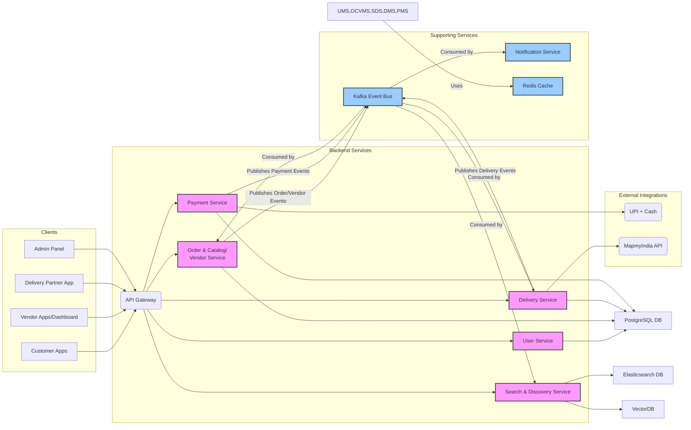

# 2\. High Level Architecture

## Technical Summary

The Tea & Snacks Delivery Aggregator platform employs a hybrid architectural style, primarily a modular monolith with a dedicated microservice for Search & Discovery. This design focuses on balancing initial development simplicity with future scalability requirements, particularly for high-traffic search functionalities. Key components include client applications (mobile/web), an API Gateway, consolidated backend services (User, Order/Catalog/Vendor, Delivery, Payment), and a separate Search & Discovery Service. Communication is primarily synchronous via REST APIs, with Apache Kafka providing asynchronous event-driven communication for decoupling and data synchronization. PostgreSQL serves as the primary relational database, supplemented by Redis for caching, Elasticsearch for search indexing, and VectorDB for recommendations. The architecture supports diverse user segments, including specialized captive audiences, by integrating with location services and pre-order systems.

## High Level Overview

1.  **Main Architectural Style:** The system adopts a **Modular Monolith** approach for most core functionalities (User, Order, Catalog, Vendor, Delivery, Payment), promoting faster initial development and easier management. However, the **Search & Discovery Service** is architected as a distinct **Microservice** from the outset due to its specialized infrastructure needs, high query volume, and critical performance requirements. This hybrid approach offers a balance between initial simplicity and targeted scalability.
2.  **Repository Structure:** (Not explicitly defined in previous context, but implicitly assumed for a modular monolith) A **Monorepo** approach is suitable, where different logical modules/services (even if deployed together initially) reside within the same repository. This facilitates code sharing and consistent tooling.
3.  **Service Architecture:** As described above, it's a **Modular Monolith** for most core business domains, with an explicit **Microservice** for Search & Discovery.
4.  **Primary User Interaction Flow or Data Flow at a Conceptual Level:**
      * Clients (Customer Apps, Vendor Apps, Delivery App, Admin Panel) interact with the system via the API Gateway.
      * The API Gateway routes requests to the appropriate backend service (UMS, OCVMS, SDS, DMS, PMS).
      * Transactional data is primarily handled by PostgreSQL.
      * Changes in OCVMS, DMS, or PMS publish events to Kafka.
      * SDS and NOTIF\_SVC consume events from Kafka for indexing, recommendations, and real-time notifications.
      * Caching is utilized across services via Redis for performance.
      * DMS integrates with external mapping APIs, and PMS integrates with external payment gateways.
5.  **Key Architectural Decisions and their Rationale:**
      * **Modular Monolith + Dedicated Search Microservice:** This hybrid approach reduces initial complexity by consolidating related functionalities into larger modules while isolating the highly performant and infrastructure-intensive search capabilities. It allows for easier future decomposition of other modules if needed.
      * **API Gateway:** Provides a single, secure entry point, handling cross-cutting concerns like authentication, rate limiting, and request routing, simplifying client-side interactions.
      * **Event-Driven Communication (Kafka):** Decouples services, enables asynchronous processing, supports real-time data synchronization for search/notifications, and improves system resilience against failures.
      * **PostgreSQL as Primary DB:** A robust, feature-rich relational database suitable for core transactional data and maintaining data consistency.
      * **Elasticsearch & VectorDB for Search:** Specialized databases for highly efficient full-text search and advanced vector-based recommendations, crucial for user experience.
      * **Redis for Caching:** Significantly improves performance and reduces database load by caching frequently accessed data.

## High Level Project Diagram

## Architectural and Design Patterns

  - **Modular Monolith:** Start with a cohesive application structured into loosely coupled modules that can be extracted into separate microservices in the future. - *Rationale:* Reduces initial complexity and operational overhead while maintaining the flexibility to scale specific parts of the system as needed.
  - **Microservices (for Search & Discovery):** Decompose the highly specialized and frequently accessed search functionality into an independent service. - *Rationale:* Enables independent scaling, technology choice, and deployment for a critical, performance-sensitive component, ensuring it can handle high loads and specialized infrastructure.
  - **API Gateway Pattern:** Centralize API access for all client applications. - *Rationale:* Provides a single entry point, simplifies client-side code, and enables cross-cutting concerns (authentication, rate limiting) to be handled uniformly.
  - **Event-Driven Architecture (EDA):** Utilize a message broker for asynchronous communication between services. - *Rationale:* Decouples services, improves system responsiveness by offloading long-running tasks, facilitates data synchronization for search/notifications, and enhances overall system resilience.
  - **Database per Service (Logical Separation):** While initially using a single PostgreSQL instance, maintain logical separation of data concerns per module/service. - *Rationale:* Prepares for future physical database separation (e.g., sharding or dedicated DBs per microservice) if scalability demands it, without increasing initial operational complexity.
  - **Caching Pattern:** Employ an in-memory data store for frequently accessed data. - *Rationale:* Significantly reduces latency for read-heavy operations, decreases load on primary databases, and improves overall system performance.
  - **Repository Pattern:** Abstract data access logic from business logic within each service/module. - *Rationale:* Promotes testability, allows for easier migration to different data storage technologies, and enforces a clean separation of concerns.
