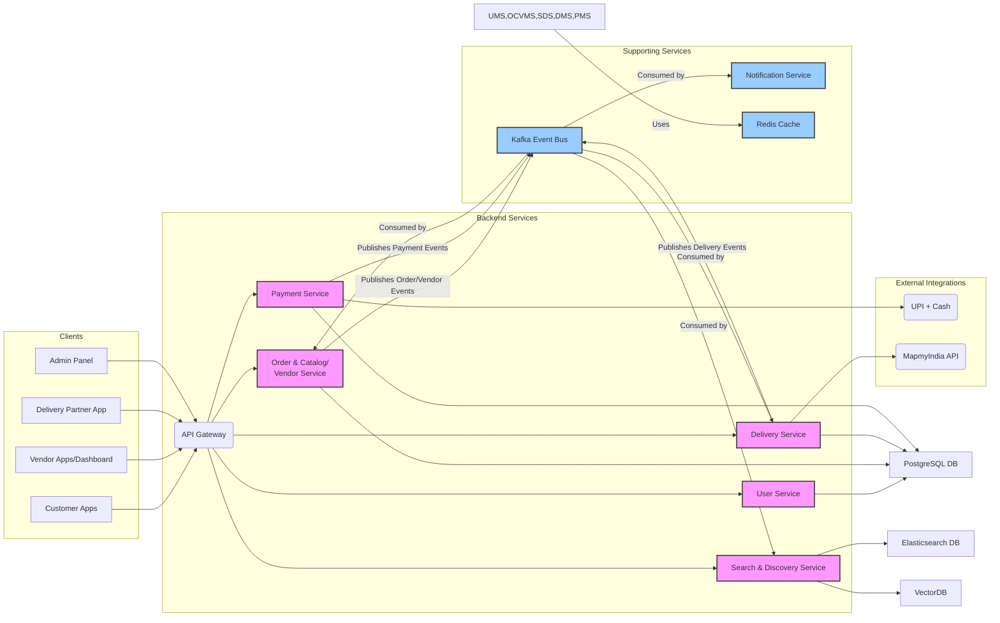

# 5\. Components

## API Gateway (API\_GW)

**Responsibility:** Single entry point for all client requests, routing, authentication, rate limiting, and caching.

**Key Interfaces:**

  - All public REST API endpoints exposed to client applications.
  - Internal routing interface to backend services.

**Dependencies:** UMS (for authentication/authorization), all backend services (OCVMS, SDS, DMS, PMS).

**Technology Stack:** AWS API Gateway

## User Management Service (UMS)

**Responsibility:** Manages user authentication, authorization, registration, profile management, and user roles.

**Key Interfaces:**

  - `POST /users/register` - User registration.
  - `POST /users/login` - User login, JWT generation.
  - `GET /users/{userId}` - Fetch user profile.
  - `PUT /users/{userId}` - Update user profile.
  - `GET /users/{userId}/roles` - Get user roles.

**Dependencies:** PG\_DB, REDIS\_CACHE (for sessions/tokens).

**Technology Stack:** Spring Boot (Java), Spring Data JPA, PostgreSQL, Spring Security, JWT.

## Order & Catalog/Vendor Service (OCVMS)

**Responsibility:** Manages the full order lifecycle, vendor profiles, menu items, and aggregates data for reporting.

**Key Interfaces:**

  - `POST /orders` - Create new order.
  - `GET /orders/{orderId}` - Fetch order details.
  - `PUT /orders/{orderId}/status` - Update order status (internal/vendor).
  - `POST /vendors` - Register new vendor.
  - `GET /vendors/{vendorId}` - Fetch vendor profile.
  - `PUT /vendors/{vendorId}/menu` - Update vendor menu.
  - `GET /menus/{vendorId}` - Get menu for a vendor.
  - `GET /reports/daily-sales` - Generate sales reports.

**Dependencies:** PG\_DB, KAFKA\_EB (publishes order/vendor events), REDIS\_CACHE (for menu caching, popular items).

**Technology Stack:** Spring Boot (Java), Spring Data JPA, PostgreSQL, Apache Kafka (Producer).

## Search & Discovery Service (SDS)

**Responsibility:** Provides highly efficient search, filtering, and recommendation capabilities for vendors and menu items.

**Key Interfaces:**

  - `GET /search/vendors` - Search vendors by name, location, cuisine.
  - `GET /search/items` - Search menu items by name, category, vendor.
  - `GET /recommendations/items/{userId}` - Personalized item recommendations.
  - `GET /recommendations/vendors/{userId}` - Personalized vendor recommendations.
  - Internal Kafka consumers for data synchronization.

**Dependencies:** KAFKA\_EB (consumes OCVMS events for indexing), ES\_DB, VEC\_DB, REDIS\_CACHE (for search result caching, popular queries).

**Technology Stack:** Spring Boot (Java), Elasticsearch client, VectorDB client, Apache Kafka (Consumer).

## Delivery Service (DMS)

**Responsibility:** Manages delivery partner assignments, real-time location tracking, route optimization, and delivery status updates.

**Key Interfaces:**

  - `POST /deliveries/assign` - Assign a delivery partner to an order (internal/vendor).
  - `GET /deliveries/{deliveryId}` - Fetch delivery details.
  - `PUT /deliveries/{deliveryId}/status` - Update delivery status (by delivery partner).
  - `PUT /delivery-partners/{partnerId}/location` - Update delivery partner's real-time location.
  - Internal Kafka consumer for new order events.

**Dependencies:** PG\_DB, MAP\_API, KAFKA\_EB (publishes delivery events, consumes order events), REDIS\_CACHE (for real-time location data).

**Technology Stack:** Spring Boot (Java), Spring Data JPA, PostgreSQL, MapmyIndia API client, Apache Kafka (Producer/Consumer).

## Payment Service (PMS)

**Responsibility:** Handles payment processing, integrations with payment gateways, refunds, and transaction records.

**Key Interfaces:**

  - `POST /payments/process` - Initiate a payment for an order.
  - `GET /payments/{transactionId}` - Fetch transaction details.
  - `POST /payments/{transactionId}/refund` - Initiate a refund.
  - Internal Kafka consumer for order events (to know when payment is due).

**Dependencies:** PG\_DB, PGW, KAFKA\_EB (publishes payment events).

**Technology Stack:** Spring Boot (Java), Spring Data JPA, PostgreSQL, UPI Gateway SDKs, Apache Kafka (Producer).

## Notification Service (NOTIF\_SVC)

**Responsibility:** Sends real-time notifications (push, SMS, email, WhatsApp) based on system events.

**Key Interfaces:**

  - Internal Kafka consumers for all relevant events (order status, delivery updates, payment status).
  - Integrates with external notification providers.

**Dependencies:** KAFKA\_EB (consumes events), FCM, SendGrid, Gupshup.

**Technology Stack:** Spring Boot (Java), Kafka Consumer, FCM SDK, SendGrid SDK, Gupshup SDK.

## Component Diagrams

