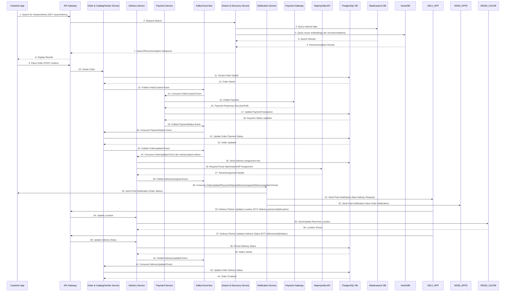

# 7\. Core Workflows

```mermaid
sequenceDiagram
    participant CUST_APP as Customer App
    participant API_GW as API Gateway
    participant OCVMS as Order & Catalog/Vendor Service
    participant DMS as Delivery Service
    participant PMS as Payment Service
    participant KAFKA_EB as Kafka Event Bus
    participant SDS as Search & Discovery Service
    participant NOTIF_SVC as Notification Service
    participant PGW as Payment Gateway
    participant MAP_API as MapmyIndia API
    participant PG_DB as PostgreSQL DB
    participant ES_DB as Elasticsearch DB
    participant VEC_DB as VectorDB

    CUST_APP->>API_GW: 1. Search for Vendors/Items (GET /search/items)
    API_GW->>SDS: 2. Request Search
    SDS->>ES_DB: 3. Query indexed data
    SDS->>VEC_DB: 4. Query vector embeddings (for recommendations)
    ES_DB-->>SDS: 5. Search Results
    VEC_DB-->>SDS: 6. Recommendation Results
    SDS-->>API_GW: 7. Search/Recommendation Response
    API_GW-->>CUST_APP: 8. Display Results

    CUST_APP->>API_GW: 9. Place Order (POST /orders)
    API_GW->>OCVMS: 10. Create Order
    OCVMS->>PG_DB: 11. Persist Order Details
    PG_DB-->>OCVMS: 12. Order Saved
    OCVMS->>KAFKA_EB: 13. Publish OrderCreated Event
    KAFKA_EB->>PMS: 14. Consume OrderCreated Event
    PMS->>PGW: 15. Initiate Payment
    PGW-->>PMS: 16. Payment Response (Success/Fail)
    PMS->>PG_DB: 17. Update PaymentTransaction
    PG_DB-->>PMS: 18. Payment Status Updated
    PMS->>KAFKA_EB: 19. Publish PaymentStatus Event
    KAFKA_EB->>OCVMS: 20. Consume PaymentStatus Event
    OCVMS->>PG_DB: 21. Update Order Payment Status
    PG_DB-->>OCVMS: 22. Order Updated
    OCVMS->>KAFKA_EB: 23. Publish OrderUpdated Event

    KAFKA_EB->>DMS: 24. Consume OrderUpdated Event (for new/accepted orders)
    DMS->>PG_DB: 25. Store Delivery Assignment Info
    DMS->>MAP_API: 26. Request Route Optimization/DP Assignment
    MAP_API-->>DMS: 27. Route/Assignment Details
    DMS->>KAFKA_EB: 28. Publish DeliveryAssigned Event

    KAFKA_EB->>NOTIF_SVC: 29. Consume OrderUpdated/PaymentStatus/DeliveryAssigned/DeliveryUpdated Events
    NOTIF_SVC->>CUST_APP: 30. Send Push Notification (Order Status)
    NOTIF_SVC->>DELV_APP: 31. Send Push Notification (New Delivery Request)
    NOTIF_SVC->>VEND_APPS: 32. Send Push Notification (New Order Notification)

    DELV_APP->>API_GW: 33. Delivery Partner Updates Location (PUT /delivery-partners/{id}/location)
    API_GW->>DMS: 34. Update Location
    DMS->>REDIS_CACHE: 35. Store/Update Real-time Location
    REDIS_CACHE-->>DMS: 36. Location Stored

    DELV_APP->>API_GW: 37. Delivery Partner Updates Delivery Status (PUT /deliveries/{id}/status)
    API_GW->>DMS: 38. Update Delivery Status
    DMS->>PG_DB: 39. Persist Delivery Status
    PG_DB-->>DMS: 40. Status Saved
    DMS->>KAFKA_EB: 41. Publish DeliveryUpdated Event
    KAFKA_EB->>OCVMS: 42. Consume DeliveryUpdated Event
    OCVMS->>PG_DB: 43. Update Order Delivery Status
    PG_DB-->>OCVMS: 44. Order Finalized

```
