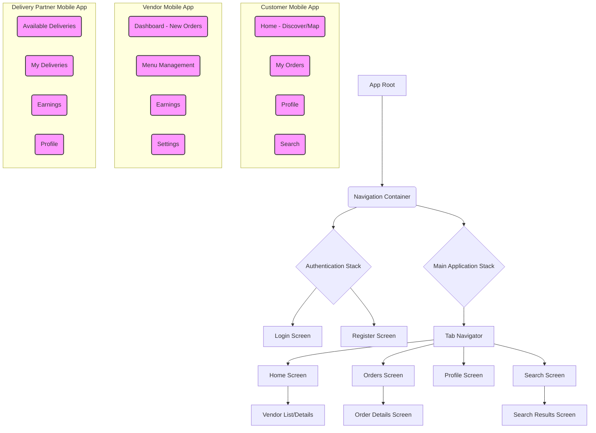
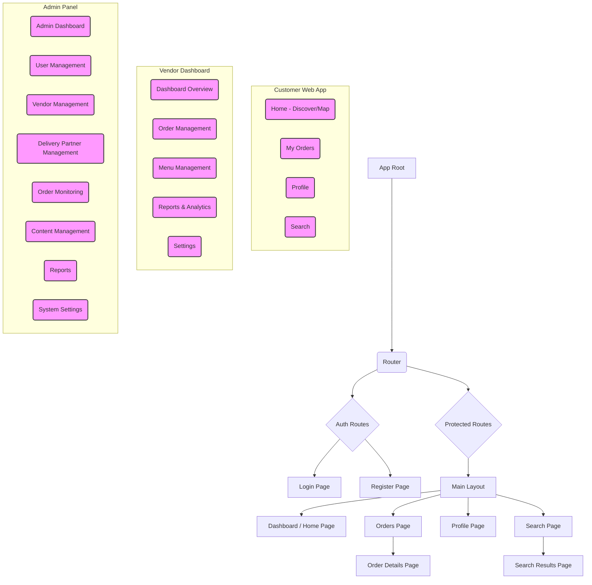

## Frontend Architecture Design Document: Tea & Snacks Delivery Aggregator

**Document Version:** 1.0 (Frontend)
**Date:** July 27, 2025
**Prepared By:** BMAD Method

-----

### 1\. Introduction

This document outlines the frontend architectural design for the Tea & Snacks Delivery Aggregator platform. It focuses on the client-side applications (Customer, Vendor, Delivery Partner, and Admin Panel) and details the technology choices, design patterns, state management, component organization, and deployment considerations. This document is to be used in conjunction with the Backend Architecture Design Document (Version 1.5).

#### Relationship to Backend Architecture:

This frontend architecture is designed to seamlessly integrate with the backend services, leveraging the defined REST API specifications, JWT-based authentication, and Kafka-driven real-time notifications via Firebase Cloud Messaging (FCM).

#### Starter Template or Existing Project

N/A

#### Change Log

| Date | Version | Description | Author |
|---|---|---|---|
| July 27, 2025 | 1.0 | Initial Frontend Architecture Document | BMAD Method |

### 2\. High Level Architecture

#### Technical Summary

The frontend for the Tea & Snacks Delivery Aggregator will consist of mobile applications built with React Native (for Customers, Vendors, and Delivery Partners) and web applications built with React (for Customer Web, Vendor Dashboard, and Admin Panel). A mono-repository approach will be considered for shared components and utilities between React Native and React projects. State management will primarily utilize React Context API for simpler scenarios and Redux Toolkit for complex, global state. Navigation will be handled by React Navigation for mobile and React Router for web. All applications will interact with the backend via the API Gateway and handle JWT-based authentication and push notifications.

#### High Level Overview

1.  **Main Architectural Style:** **Component-Based Architecture** with a focus on reusable UI components and a clear separation of concerns. The mobile applications will use a **Cross-Platform** approach via React Native, while web applications will use standard React.
2.  **Repository Structure:** A **Monorepo** is recommended (e.g., using Nx or Lerna) to manage shared components (design system, utility functions, API clients, authentication logic) and separate application codebases (customer-app, vendor-app, delivery-app, admin-panel) within a single repository. This promotes code reuse and consistency.
3.  **Client Application Architecture:** Each application will follow a modular structure, dividing features into logical domains (e.g., Auth, Profile, Orders, Search, etc.).
4.  **Primary User Interaction Flow or Data Flow at a Conceptual Level:**
      * User interacts with the UI.
      * UI components trigger actions/events.
      * State management layers update local state and/or dispatch API calls.
      * API calls are made to the Backend API Gateway.
      * Responses update local state, reflecting changes in the UI.
      * Push notifications (via FCM) received by mobile apps trigger UI updates or specific actions.
5.  **Key Architectural Decisions and their Rationale:**
      * **React Native for Mobile Apps:** Enables single codebase for iOS/Android, reducing development time and maintenance overhead while providing near-native performance.
      * **React for Web Apps:** Industry standard, robust ecosystem, and strong community support for building complex web UIs. Leverages shared knowledge with React Native.
      * **API Gateway as Single Entry Point:** Simplifies API calls from the frontend by abstracting backend service complexity.
      * **JWT for Authentication:** Stateless and scalable, aligning with backend's security model.
      * **Push Notifications (FCM):** Provides real-time updates for critical events (order status, delivery updates) for mobile users, enhancing user experience.
      * **Hybrid State Management (Context + Redux Toolkit):** Balances simplicity for local state management (Context API) with the power and predictability of a centralized store for global, complex state (Redux Toolkit), improving maintainability and scalability.
      * **Monorepo:** Facilitates code sharing between web and mobile (e.g., DTOs, utility functions, design system components), promoting consistency and reducing duplication.

#### High Level Project Diagram

```mermaid
graph LR
    subgraph Frontend Applications
        C_MOB[Customer Mobile App]
        V_MOB[Vendor Mobile App]
        D_MOB[Delivery Mobile App]
        C_WEB[Customer Web App]
        V_DASH[Vendor Dashboard]
        ADM_PAN[Admin Panel]
    end

    subgraph Shared Components & Logic
        SH_UI[Shared UI Components]
        SH_API[Shared API Clients]
        SH_AUTH[Shared Auth Logic]
        SH_UTIL[Shared Utilities]
    end

    subgraph Backend Infrastructure
        API_GW(API Gateway)
        FCM(Firebase Cloud Messaging)
    end

    C_MOB --> API_GW
    V_MOB --> API_GW
    D_MOB --> API_GW
    C_WEB --> API_GW
    V_DASH --> API_GW
    ADM_PAN --> API_GW

    API_GW -- REST API --> Backend Services

    FCM -- Push Notifications --> C_MOB
    FCM -- Push Notifications --> V_MOB
    FCM -- Push Notifications --> D_MOB

    C_MOB -. uses .-> SH_UI
    C_MOB -. uses .-> SH_API
    C_MOB -. uses .-> SH_AUTH
    C_MOB -. uses .-> SH_UTIL

    V_MOB -. uses .-> SH_UI
    V_MOB -. uses .-> SH_API
    V_MOB -. uses .-> SH_AUTH
    V_MOB -. uses .-> SH_UTIL

    D_MOB -. uses .-> SH_UI
    D_MOB -. uses .-> SH_API
    D_MOB -. uses .-> SH_AUTH
    D_MOB -. uses .-> SH_UTIL

    C_WEB -. uses .-> SH_UI
    C_WEB -. uses .-> SH_API
    C_WEB -. uses .-> SH_AUTH
    C_WEB -. uses .-> SH_UTIL

    V_DASH -. uses .-> SH_UI
    V_DASH -. uses .-> SH_API
    V_DASH -. uses .-> SH_AUTH
    V_DASH -. uses .-> SH_UTIL

    ADM_PAN -. uses .-> SH_UI
    ADM_PAN -. uses .-> SH_API
    ADM_PAN -. uses .-> SH_AUTH
    ADM_PAN -. uses .-> SH_UTIL

    style C_MOB fill:#ccf,stroke:#333,stroke-width:2px
    style V_MOB fill:#ccf,stroke:#333,stroke-width:2px
    style D_MOB fill:#ccf,stroke:#333,stroke-width:2px
    style C_WEB fill:#ccf,stroke:#333,stroke-width:2px
    style V_DASH fill:#ccf,stroke:#333,stroke-width:2px
    style ADM_PAN fill:#ccf,stroke:#333,stroke-width:2px
    style SH_UI fill:#9cf,stroke:#333,stroke-width:2px
    style SH_API fill:#9cf,stroke:#333,stroke-width:2px
    style SH_AUTH fill:#9cf,stroke:#333,stroke-width:2px
    style SH_UTIL fill:#9cf,stroke:#333,stroke-width:2px
```

#### Architectural and Design Patterns

  - **Component-Based Architecture:** All UIs are built as a composition of reusable components.
      - *Rationale:* Promotes reusability, modularity, and easier maintenance.
  - **Atomic Design (Optional but Recommended):** Organize components into atoms, molecules, organisms, templates, and pages.
      - *Rationale:* Provides a clear methodology for building robust and scalable design systems.
  - **Container/Presentation Pattern:** Separate components responsible for data fetching/logic (containers) from components responsible for rendering UI (presentational).
      - *Rationale:* Improves separation of concerns, reusability of presentational components, and testability.
  - **Centralized State Management (Redux Toolkit):** For global and complex application state.
      - *Rationale:* Provides a predictable state container, simplifies debugging, and manages complex asynchronous operations.
  - **Context API:** For localized state sharing within specific component trees.
      - *Rationale:* Simpler for less complex state that doesn't need to be globally accessible, reducing boilerplate compared to Redux.
  - **Event-Driven UI:** UI updates triggered by state changes and notifications.
      - *Rationale:* Reactive and responsive user experience.
  - **API Client Layer:** Abstract direct API calls behind a dedicated client layer.
      - *Rationale:* Centralizes API logic, simplifies error handling, and allows for easier mocking and testing.
  - **Modular Feature Organization:** Organize code by feature, rather than by type (e.g., `features/auth`, `features/orders`).
      - *Rationale:* Improves discoverability, reduces coupling, and makes code easier to scale.

### 3\. Tech Stack

This is the DEFINITIVE technology selection section.

#### Cloud Infrastructure

  - **Cloud Provider:** AWS
  - **Key Services:** AWS Amplify (for CI/CD, hosting for web apps), AWS S3 (for static asset hosting), AWS CloudFront (CDN for web apps), Firebase (for FCM push notifications).
  - **Deployment Regions:** eu-west-1 (Ireland) or ap-south-1 (Mumbai, India) - *Align with Backend: ap-south-1*

#### Technology Stack Table

| Category | Technology | Version | Purpose | Rationale |
|---|---|---|---|---|
| **Language** | JavaScript/TypeScript | ES2020+ / 5.x | Primary frontend development language | TypeScript enhances code quality, readability, and maintainability with static typing. |
| **Framework (Mobile)** | React Native | 0.73.x | Cross-platform mobile app development | Single codebase for iOS and Android, large community, hot reloading, good performance. |
| **Framework (Web)** | React | 18.x | Web application development | Component-based, declarative, large ecosystem, strong community support, well-suited for SPAs. |
| **State Management** | Redux Toolkit | 2.0.x | Global state management | Opinionated, simplifies Redux setup, includes Redux Thunk for async logic, RTK Query for data fetching. |
| **State Management (Local/Context)** | React Context API | Built-in | Localized state sharing | Simpler for props drilling avoidance, less boilerplate than Redux for non-global state. |
| **Routing (Mobile)** | React Navigation | 6.x | In-app navigation for React Native | Robust, flexible, and widely adopted navigation solution for React Native. |
| **Routing (Web)** | React Router DOM | 6.x | Client-side routing for React web apps | Declarative routing, widely used, good for single-page applications. |
| **API Client** | Axios | 1.x | HTTP client for backend API calls | Promise-based, easy to use, interceptors for auth/error handling. |
| **Push Notifications** | Firebase Cloud Messaging (FCM) | Latest SDK | Real-time push notifications for mobile apps | Backend-agnostic, reliable, widely used for mobile push notifications. |
| **UI Component Library** | NativeBase (React Native) / Chakra UI (React Web) | Latest stable | Pre-built UI components | Accelerates UI development, ensures consistency, accessible components. |
| **Forms** | React Hook Form / Formik | Latest stable | Form management and validation | Improves performance, reduces re-renders, simplifies complex form logic. |
| **Validation** | Zod / Yup | Latest stable | Schema validation | Strong schema definition, integrates well with form libraries. |
| **Styling** | Styled Components / Emotion (CSS-in-JS) | Latest stable | Component-scoped styling | Enables dynamic styling, strong tooling integration, avoids CSS conflicts. |
| **Linting** | ESLint | 8.x | Code linting | Enforces code style, identifies potential errors, ensures consistency. |
| **Formatting** | Prettier | 3.x | Code formatting | Automated code formatting to maintain consistent style. |
| **Testing (Unit/Component)** | Jest / React Testing Library | Latest stable | Unit and component testing | Jest for test runner/assertions, RTL for user-centric component testing. |
| **Testing (E2E Mobile)** | Detox (React Native) | Latest stable | End-to-end testing for mobile | Grey box end-to-end testing for React Native applications. |
| **Testing (E2E Web)** | Cypress | 13.x | End-to-end testing for web | Fast, reliable, and easy-to-use E2E testing framework for web. |
| **Build Tools** | Metro (React Native) / Webpack/Vite (React Web) | - | Bundling and transpilation | Standard bundlers for React Native and React projects respectively. |
| **CI/CD** | AWS Amplify / GitHub Actions / Jenkins | - | Continuous Integration/Deployment | Automates build, test, and deployment workflows. |

### 4\. Data Models (Frontend View)

Frontend data models are primarily representations of the backend's API response DTOs, often adapted for UI consumption. They should reflect the `REST API Spec` defined in the backend document.

#### User

  * `id`: string (UUID)
  * `username`: string
  * `email`: string
  * `phone_number`: string
  * `userType`: 'CUSTOMER' | 'VENDOR' | 'DELIVERY\_PARTNER' | 'ADMIN'
  * `firstName`: string (optional)
  * `lastName`: string (optional)
  * `address`: { street: string, city: string, state: string, zipCode: string, latitude: number, longitude: number } (optional)
  * `companyId`: string (UUID, optional for B2B)
  * `internalDeliveryPoint`: string (optional for B2B)

#### Vendor

  * `id`: string (UUID)
  * `userId`: string (UUID)
  * `name`: string
  * `description`: string
  * `address`: { street: string, city: string, state: string, zipCode: string, latitude: number, longitude: number }
  * `phoneNumber`: string
  * `email`: string
  * `rating`: number
  * `status`: 'ACTIVE' | 'INACTIVE' | 'PENDING\_APPROVAL'
  * `operatingHours`: Array\<{ day: string, open: string, close: string }\>
  * `isOpen`: boolean

#### MenuItem

  * `id`: string (UUID)
  * `vendorId`: string (UUID)
  * `name`: string
  * `description`: string
  * `price`: number
  * `category`: string
  * `imageUrl`: string (optional)
  * `isAvailable`: boolean
  * `preparationTimeMinutes`: number

#### Order

  * `id`: string (UUID)
  * `customerId`: string (UUID)
  * `vendorId`: string (UUID)
  * `deliveryPartnerId`: string (UUID, optional)
  * `status`: 'PENDING' | 'ACCEPTED' | 'PREPARING' | 'READY\_FOR\_PICKUP' | 'ON\_THE\_WAY' | 'DELIVERED' | 'CANCELLED' | 'REJECTED'
  * `totalAmount`: number
  * `paymentStatus`: 'PENDING' | 'PAID' | 'FAILED' | 'REFUNDED'
  * `deliveryAddress`: { street: string, city: string, state: string, zipCode: string, latitude: number, longitude: number }
  * `orderedAt`: string (ISO 8601 date string)
  * `estimatedDeliveryTime`: string (ISO 8601 date string, optional)
  * `deliveredAt`: string (ISO 8601 date string, optional)
  * `specialInstructions`: string (optional)
  * `trainNumber`: string (optional for train delivery)
  * `coachNumber`: string (optional for train delivery)
  * `seatNumber`: string (optional for train delivery)
  * `stationCode`: string (optional for train delivery)
  * `scheduledArrivalTime`: string (ISO 8601 date string, optional for train/bus)
  * `busOperator`: string (optional for bus delivery)
  * `busNumber`: string (optional for bus delivery)
  * `scheduledStopTime`: string (ISO 8601 date string, optional for bus)
  * `companyId`: string (UUID, optional for B2B)
  * `internalDeliveryPoint`: string (optional for B2B)
  * `items`: Array\<{ menuItemId: string, quantity: number, priceAtOrder: number, notes?: string }\>

#### DeliveryPartner

  * `id`: string (UUID)
  * `userId`: string (UUID)
  * `vehicleType`: 'BIKE' | 'SCOOTER' | 'BICYCLE' | 'CAR'
  * `currentLocation`: { latitude: number, longitude: number }
  * `availabilityStatus`: 'ONLINE' | 'OFFLINE' | 'ON\_DELIVERY'
  * `rating`: number

### 5\. Components

#### Component Organization

Components will be organized by feature, with a clear distinction between shared/reusable components (UI Kit, common logic) and application-specific components.

##### Shared Components (across all applications, housed in monorepo's `packages/shared-ui` or similar)

  - **UI Kit/Design System:**
      - `Atoms`: Basic building blocks (Button, Text, Input, Icon, Card, Avatar).
      - `Molecules`: Simple combinations of atoms (SearchBar, NavItem, ListItem, Loader).
      - `Organisms`: Complex UI elements composed of molecules and atoms (Header, Footer, ProductCard, OrderSummary, Modals).
  - **Common Layouts:** `AuthLayout`, `MainLayout`, `DashboardLayout`.
  - **Navigation Components:** Custom navigators, tab bars, drawer menus.
  - **Utility Components:** `ErrorBoundary`, `LoadingSpinner`, `ToastNotification`.
  - **Form Components:** Reusable form fields, validation helpers.

##### Application-Specific Components (within each application's `src/features` folder)

  - **Features:** Grouped by logical feature domains. Each feature folder contains:
      - `components`: UI components specific to that feature (e.g., `OrderCard` within `orders` feature).
      - `containers`: Components handling data fetching and logic for the feature (e.g., `OrderListContainer`).
      - `screens` / `pages`: Top-level components representing a screen/page in the application (e.g., `HomeScreen`, `ProfileScreen`, `OrderDetailsPage`).
      - `hooks`: Custom React hooks for feature-specific logic.
      - `types`: TypeScript types/interfaces specific to the feature.
      - `api`: API client functions specific to the feature.
      - `store`: Redux slices for feature-specific state.

#### UI Component Diagrams

##### Mobile Applications (Customer, Vendor, Delivery Partner)



##### Web Applications (Customer Web, Vendor Dashboard, Admin Panel)



### 6\. External APIs (Frontend Perspective)

Frontend applications will primarily interact with the backend services via the API Gateway. Direct integration with other external APIs will be minimal, mainly for push notifications.

#### Backend API Gateway

  - **Purpose:** The unified entry point for all frontend applications to access backend services.
  - **Base URL:** `https://api.teasansnacks.com/v1` (Production) / `https://dev.teasansnacks.com/v1` (Development)
  - **Authentication:** JWT (Bearer Token) in `Authorization` header.
  - **Error Handling:** Expects a standardized error response format as defined in the Backend API Spec.
  - **Key Endpoints Consumed (examples from backend spec):**
      - `/auth/register`, `/auth/login`
      - `/users/{userId}`
      - `/vendors`, `/vendors/{vendorId}/menu`
      - `/orders`, `/orders/{orderId}/status`
      - `/payments/process`
      - `/search/vendors`, `/search/items`, `/recommendations/items/{userId}`
      - `/delivery-partners/{partnerId}/location`, `/deliveries/{deliveryId}/status`

#### Firebase Cloud Messaging (FCM)

  - **Purpose:** To receive real-time push notifications from the backend Notification Service.
  - **Integration:** Via Firebase SDK (for React Native/Web).
  - **Flow:**
    1.  Mobile app initializes Firebase and requests notification permissions.
    2.  FCM token is generated and sent to the Backend User Management Service for storage, linking it to the user's `user_id`.
    3.  Backend's Notification Service sends messages to specific FCM tokens based on events (e.g., order status change).
    4.  Mobile app receives the notification (foreground/background/killed state) and handles it (display alert, update UI, navigate).

### 7\. Core Workflows

#### Authentication Workflow

1.  **User Registration/Login:**

      * User enters credentials (username/password/email/phone).
      * Frontend sends `POST /auth/register` or `POST /auth/login` to API Gateway via Axios.
      * On successful response (JWT token received):
          * Store JWT (access token and refresh token) securely (e.g., AsyncStorage for RN, LocalStorage for Web).
          * Update Redux store with user authentication status and profile.
          * Navigate user to main application (e.g., Home Screen/Dashboard).
          * **For Mobile:** If login, obtain FCM token and send it to the backend (`/users/{userId}/fcm-token`) for association.
      * On error: Display error message to user.

2.  **Authenticated Requests:**

      * Axios interceptors automatically attach the `Authorization: Bearer <JWT>` header to all outgoing requests.
      * If a request returns 401 (Unauthorized) due to token expiration:
          * Attempt to refresh the token using the refresh token (send `POST /auth/refresh-token` to backend - assuming this endpoint is added to backend).
          * If refresh successful, update tokens and retry the original request.
          * If refresh fails, clear authentication state and redirect user to Login screen.

#### Order Placement Workflow (Customer App)

1.  **Search & Browse:**
      * Customer uses Search component (`GET /search/vendors`, `GET /search/items`) to find vendors and menu items.
      * Results displayed using `VendorCard` and `MenuItemCard` components.
2.  **Add to Cart:**
      * Customer adds items to a local "cart" state (managed by Redux slice).
3.  **Checkout & Order Confirmation:**
      * Customer proceeds to checkout screen.
      * Input delivery address (or select from saved addresses), special instructions, select captive audience options (train/bus/factory details).
      * Frontend sends `POST /orders` to API Gateway with order details.
      * Backend responds with `orderId` and payment details.
      * Frontend navigates to payment initiation screen.
4.  **Payment:**
      * Customer selects payment method (UPI, Cash).
      * For UPI, frontend sends `POST /payments/process` to get redirect URL, then redirects to UPI gateway.
      * Upon successful payment callback (or payment confirmation for Cash), backend updates order status.
      * Frontend polls order status or relies on push notification for payment success.
5.  **Order Tracking:**
      * Customer views order status on "My Orders" screen.
      * Order updates (e.g., PREPARING, ON\_THE\_WAY) are received via push notifications and update Redux store, triggering UI re-renders.
      * Map view for real-time delivery partner tracking (if applicable, using MapmyIndia JS SDK for frontend map display).

#### Delivery Workflow (Delivery Partner App)

1.  **Availability Toggle:**
      * Delivery Partner toggles `availabilityStatus` (ONLINE/OFFLINE) via `PUT /delivery-partners/{partnerId}/location` (updating status and sending location).
2.  **New Delivery Notification:**
      * Receives push notification (`DeliveryAssigned` event from backend).
      * App displays a pop-up/new task on "Available Deliveries" screen.
3.  **Accept/Reject Delivery:**
      * Delivery Partner accepts or rejects (`PUT /orders/{orderId}/status`) a delivery.
4.  **In-App Navigation:**
      * Once accepted, displays pick-up and delivery locations.
      * Integrates with device's native map for navigation or embeds MapmyIndia map if licensed and feasible.
5.  **Status Updates:**
      * Delivery Partner updates delivery status (`PUT /deliveries/{deliveryId}/status`) at various stages (PICKED\_UP, ON\_THE\_WAY, DELIVERED). These trigger push notifications to customer and vendor.
      * Real-time location updates sent periodically (`PUT /delivery-partners/{partnerId}/location`).

### 8\. REST API Spec (Frontend perspective)

This section maps directly to the backend's OpenAPI specification, but focuses on how the frontend consumes and interprets it. The frontend will generate types from this spec for strong type checking with TypeScript.

*(The content of the OpenAPI spec from the backend document would be duplicated here, indicating its direct use by the frontend. For brevity in this response, I will omit the full copy of the YAML, but in an actual document, it would be included.)*

**Key Considerations for Frontend Consumption:**

  - **Type Generation:** Use tools like OpenAPI Generator or Swagger Codegen to generate TypeScript types and API client stubs from the OpenAPI YAML/JSON, ensuring type safety between frontend and backend.
  - **Error Handling:** Implement global Axios interceptors to catch HTTP errors (e.g., 4xx, 5xx) and transform them into user-friendly error messages based on the `code` and `message` fields in the backend's error response format.
  - **Authentication Interceptor:** An Axios interceptor will be used to automatically attach the `Authorization` header with the JWT token for every authenticated request. It will also handle token refreshing.

### 9\. Frontend State Management

#### Global Application State (Redux Toolkit)

  - **Purpose:** Manage critical, global state that needs to be accessible across different parts of the application and persists across component unmounts.
  - **Key Slices:**
      - `authSlice`: User authentication status, JWT tokens, user profile data.
      - `cartSlice`: Current user's shopping cart items, total.
      - `ordersSlice`: List of user's orders, current order details.
      - `notificationsSlice`: Queue of received push notifications, read/unread status.
      - `settingsSlice`: User preferences, app-wide settings.
      - `vendorSlice`: Vendor-specific data (for Vendor/Admin apps: list of vendors, selected vendor, their menu).
      - `deliverySlice`: Delivery partner specific data (for Delivery app: assigned deliveries, real-time location).
  - **Asynchronous Logic:** Handled using Redux Thunks or RTK Query's automatic request lifecycle management for API calls.

#### Local Component State (React Hook: `useState`, `useReducer`)

  - **Purpose:** Manage transient state specific to a single component or a small, isolated component tree.
  - **Examples:** Form input values, UI toggles (e.g., modal open/close), local loading indicators.

#### Context API

  - **Purpose:** Share data between components without explicit prop drilling, suitable for theme, language, or user-specific preferences that are consumed by many components but don't require the full power of Redux.
  - **Examples:** `AuthContext` (for authentication state, even if managed by Redux, provides simpler access), `ThemeContext`, `LocationContext`.

#### Data Fetching

  - **RTK Query (Recommended for all API calls):** A powerful data fetching and caching tool built into Redux Toolkit.
      - *Rationale:* Eliminates boilerplate, handles caching, revalidation, optimistic updates, and error states automatically.
  - **Manual Axios + Redux Thunk:** For cases where RTK Query's patterns don't fit perfectly (e.g., highly custom polling, non-standard request flows, or when RTK Query is overkill for simple apps).

### 10\. Source Tree

#### Monorepo Structure (using Nx or Lerna)

```plaintext
project-root/
├── apps/                               # Contains individual applications
│   ├── customer-mobile-app/            # React Native Customer App
│   │   ├── src/
│   │   │   ├── assets/
│   │   │   ├── components/             # Reusable components specific to this app
│   │   │   ├── features/               # Feature-sliced modules (Auth, Orders, Profile, Search)
│   │   │   │   ├── auth/
│   │   │   │   │   ├── components/
│   │   │   │   │   ├── screens/
│   │   │   │   │   ├── store/          # Redux slices for auth
│   │   │   │   │   └── hooks/
│   │   │   │   ├── orders/
│   │   │   │   ├── profile/
│   │   │   │   └── search/
│   │   │   ├── navigation/             # React Navigation setup
│   │   │   ├── services/               # App-specific services (e.g., location, push notification listeners)
│   │   │   ├── store/                  # Redux store configuration
│   │   │   ├── App.tsx
│   │   │   └── index.js
│   │   ├── metro.config.js
│   │   ├── package.json
│   │   └── tsconfig.json
│   ├── vendor-mobile-app/              # React Native Vendor App (similar structure)
│   │   └── ...
│   ├── delivery-mobile-app/            # React Native Delivery Partner App (similar structure)
│   │   └── ...
│   ├── customer-web-app/               # React Web Customer App
│   │   ├── public/
│   │   ├── src/
│   │   │   ├── assets/
│   │   │   ├── components/             # Reusable components specific to this app
│   │   │   ├── features/               # Feature-sliced modules (Auth, Orders, Profile, Search)
│   │   │   │   ├── auth/
│   │   │   │   │   ├── components/
│   │   │   │   │   ├── pages/
│   │   │   │   │   ├── store/
│   │   │   │   │   └── hooks/
│   │   │   │   ├── orders/
│   │   │   │   ├── profile/
│   │   │   │   └── search/
│   │   │   ├── layouts/                # App-specific layouts
│   │   │   ├── router/                 # React Router setup
│   │   │   ├── services/
│   │   │   ├── store/
│   │   │   ├── App.tsx
│   │   │   └── index.tsx
│   │   ├── package.json
│   │   ├── tsconfig.json
│   │   └── webpack.config.js / vite.config.ts
│   ├── vendor-dashboard/               # React Web Vendor Dashboard (similar structure)
│   │   └── ...
│   └── admin-panel/                    # React Web Admin Panel (similar structure)
│       └── ...
├── packages/                           # Shared libraries/packages
│   ├── shared-ui/                      # Reusable UI components (Atoms, Molecules, Organisms)
│   │   ├── src/
│   │   │   ├── components/
│   │   │   ├── theme/                  # Design tokens, theme config
│   │   │   └── index.ts
│   │   └── package.json
│   ├── api-clients/                    # Common API client setup (Axios instance, interceptors)
│   │   ├── src/
│   │   │   ├── auth.ts                 # Auth-related API calls
│   │   │   ├── orders.ts               # Orders-related API calls
│   │   │   ├── index.ts                # Entry point for API clients
│   │   │   └── types.ts                # Generated types from OpenAPI spec
│   │   └── package.json
│   ├── auth-utils/                     # Shared authentication logic (token storage, refresh logic)
│   │   ├── src/
│   │   │   └── index.ts
│   │   └── package.json
│   └── common-utils/                   # General utility functions
│       ├── src/
│       │   └── index.ts
│       └── package.json
├── tools/                              # Nx/Lerna configuration (e.g., `nx.json`, `lerna.json`)
├── .editorconfig
├── .eslintignore
├── .eslintrc.js
├── .prettierignore
├── .prettierrc.js
├── README.md
├── package.json                        # Monorepo root package.json
└── tsconfig.base.json                  # Base TypeScript config for monorepo
```

### 11\. Infrastructure and Deployment

#### Deployment Strategy

  - **Mobile Apps (React Native):**

      - **iOS:** Apple App Store distribution via Apple Developer Program. Build and sign using Xcode Cloud or CI/CD runner, then submit to TestFlight for testing, and finally to App Store for review.
      - **Android:** Google Play Store distribution via Google Play Console. Build signed APK/AAB using Gradle, then upload to Play Console for internal/alpha/beta testing, and finally to production.
      - **CI/CD:** Utilize Fastlane for automating mobile builds, testing, and deployment to app stores. Integrate Fastlane with Jenkins or GitHub Actions.
      - **Over-the-Air (OTA) Updates:** Consider tools like CodePush for minor bug fixes and feature updates without requiring a full app store re-submission (for JavaScript bundle changes).

  - **Web Apps (React):**

      - **Hosting:** AWS Amplify for streamlined hosting, CI/CD, and serverless backend integration (though not primary for this project, its CI/CD is useful). Alternatively, host static assets on AWS S3 and distribute via AWS CloudFront (CDN).
      - **CI/CD:** Configure Jenkins or GitHub Actions to:
        1.  Build the React application (e.g., `npm run build`).
        2.  Run unit and E2E tests.
        3.  Deploy the static build output to AWS Amplify or S3.
        4.  Invalidate CloudFront cache.
      - **Deployment Strategy:** Automated deployments on every merge to `main`/`develop` branches for `staging` and `production` environments.

#### Environments

  - **Development (local):** Developers run apps locally against `dev` backend environment. Hot reloading for fast iteration.
  - **Development (remote/dev build):** Deployed to AWS Amplify dev branch for sharing with other developers/QA. Connected to `dev` backend.
  - **Staging:** Production-like environment for UAT, integration testing, and performance testing.
      - *Details:* Deployed from `staging` branch, connected to `staging` backend.
  - **Production:** Live environment serving end-users.
      - *Details:* Deployed from `main` branch, connected to `production` backend. Served globally via CDN.

#### Environment Promotion Flow

Similar to backend, with specific steps for mobile app store submissions:

```text
Feature Branch Push
       ↓
    Jenkins/Amplify Build (Web) / Fastlane Build (Mobile)
       ↓
    Unit/Component Tests
       ↓
    Build Frontend Artifacts (Web: static files / Mobile: APK/IPA)
       ↓
    Deploy to 'dev' (Web: Amplify/S3 / Mobile: Internal TestFlight/Google Play Internal Test)
       ↓
    Integration Tests (automated, against dev backend)
       ↓
    Code Review & QA Approval
       ↓
    Manual Test/UAT in 'dev'
       ↓
    Promote to 'staging' (Web: Amplify/S3 / Mobile: TestFlight/Google Play Alpha/Beta)
       ↓
    Comprehensive E2E Tests (automated, against staging backend)
       ↓
    Performance/Load Tests (for Web)
       ↓
    Security Scans (if applicable)
       ↓
    Stakeholder/Product Owner Approval
       ↓
    Promote to 'prod' (Web: Amplify/S3 + CloudFront / Mobile: App Store/Google Play Production Release)
       ↓
    Monitor & Observe
       ↓
    Post-Deployment Validation
```

#### Rollback Strategy

  - **Web Apps:** Leverages AWS Amplify's or CloudFront's versioning. A quick rollback can be achieved by pointing the CDN to a previous working build version in S3.
  - **Mobile Apps:** For critical issues, force users to update to the latest fixed version via app store mechanisms. For non-critical bug fixes, OTA updates (CodePush) can provide a faster rollback by reverting to a previous JavaScript bundle.

### 12\. Error Handling Strategy

#### General Approach

  - **Centralized Error Handling:** All API errors and unhandled exceptions will be caught by a global error boundary for React (`<ErrorBoundary>`) or a top-level error handler for Redux (e.g., using `createAsyncThunk` and its rejected action handlers).
  - **User Feedback:** Display clear, user-friendly error messages (e.g., Toast notifications, inline form errors, dedicated error pages). Avoid exposing technical details to end-users.
  - **Logging:** Log errors to a client-side error tracking service (e.g., Sentry, Crashlytics for mobile) for aggregation and analysis.
  - **Standardized Error Response:** Frontend expects the backend's error format (`code`, `message`, `details`) to parse and display relevant information.

#### Error Handling Patterns

##### API Errors

  - **Axios Interceptors:**
      - **Request Interceptor:** Attach JWT token automatically.
      - **Response Interceptor:** Catch HTTP error responses (e.g., 401, 404, 500).
          - For 401 (Unauthorized): Attempt token refresh. If refresh fails, log out user.
          - For other errors: Translate backend error codes/messages into a consistent `ClientError` object.
  - **RTK Query Error Handling:** Utilize `error` property of query/mutation hooks and `isError` status. The `onError` callback can trigger global error notifications.
  - **Global Error Notification:** Display a Toast notification or similar for non-critical API errors.
  - **Retry/Refresh:** Implement retry mechanisms with exponential backoff for network issues.

##### Business Logic Errors

  - **Form Validation:** Use client-side validation (e.g., React Hook Form + Zod/Yup) to prevent invalid data from being sent to the backend, providing immediate feedback to the user.
  - **Server-Side Validation Errors:** When backend validation fails, parse the specific error messages from the API response and display them next to the relevant form fields.
  - **Custom Error Messages:** Map backend error codes (`ORDER_NOT_FOUND`, `VENDOR_UNAVAILABLE`) to user-friendly messages displayed in the UI.

##### Offline Handling (Mobile Specific)

  - **Network Connectivity Check:** Use `NetInfo` (React Native) to detect network status.
  - **Offline UI:** Display a banner or message when offline.
  - **Optimistic UI (for non-critical actions):** For actions like marking an order as "picked up" (Delivery Partner app), update UI immediately and then sync with backend when online. Implement a queue for offline mutations that can be replayed.
  - **Caching:** Cache frequently accessed read-only data (e.g., menus, past orders) locally using libraries like Redux Persist or AsyncStorage to provide an offline experience.

### 13\. Coding Standards

These standards are MANDATORY for AI agents.

#### Core Standards

  - **Languages & Runtimes:** JavaScript (ES2020+), TypeScript 5.x.
  - **Style & Linting:** ESLint with React and TypeScript plugins. Prettier for code formatting.
  - **Test Organization:** Tests must reside in the same folder as the component/module they test, with `.test.ts(x)` or `.spec.ts(x)` suffix.
  - **Naming Conventions:**
      - Components: PascalCase (e.g., `ProductCard`, `LoginScreen`).
      - Functions: camelCase.
      - Variables/Constants: camelCase for mutable, UPPER\_SNAKE\_CASE for global constants.
      - Redux Slices: camelCase (e.g., `authSlice`, `cartSlice`).

#### Critical Rules

  - **State Management:**
      - Use `useState` for simple local component state.
      - Use `useReducer` for complex local state transitions.
      - Use Redux Toolkit for global, application-wide state.
      - Avoid direct DOM manipulation; always let React manage the DOM via state updates.
  - **API Calls:**
      - All API calls must go through the shared API client (Axios instance configured with interceptors).
      - Prefer RTK Query for data fetching.
      - Handle loading, error, and success states for all API calls.
  - **Authentication:**
      - Never store sensitive data (raw passwords, unhashed tokens) in local storage. Store JWT securely.
      - Implement token refresh logic to minimize token expiry issues.
      - Protect routes based on authentication status and user roles.
  - **Prop Drilling:** Minimize prop drilling. Use Context API or Redux for sharing state that is deeply nested.
  - **Component Reusability:** Design components to be as generic and reusable as possible, especially for the shared UI library.
  - **Performance:**
      - Use `React.memo` for pure functional components to prevent unnecessary re-renders.
      - Use `useCallback` and `useMemo` for memoizing functions and values passed to child components.
      - Lazy load components and routes using `React.lazy` and `Suspense` where appropriate.
  - **Accessibility:** Ensure all UI components adhere to accessibility best practices (ARIA roles, keyboard navigation, semantic HTML).
  - **Localization:** Design components with localization in mind (e.g., using i18n libraries) from the start.

### 14\. Test Strategy and Standards

#### Testing Philosophy

  - **Approach:** Test-Driven Development (TDD) encouraged for new feature development, otherwise comprehensive automated testing.
  - **Coverage Goals:** Aim for \>90% code coverage for unit and component tests.
  - **Test Pyramid:** Prioritize unit tests (\>70%), followed by component tests (\~20%), and a small number of end-to-end tests (\~10%).

#### Test Types and Organization

##### Unit Tests

  - **Framework:** Jest
  - **Scope:** Test individual functions, utility helpers, Redux slices, and pure business logic (non-UI).
  - **Location:** Same folder as the source file, e.g., `src/utils/math.ts` and `src/utils/math.test.ts`.

**AI Agent Requirements:**

  - Generate tests for all functions within `services`, `hooks`, `utils`, and Redux slices.
  - Cover edge cases, invalid inputs, and error conditions.

##### Component Tests

  - **Framework:** React Testing Library (RTL) with Jest runner.
  - **Scope:** Test individual React components in isolation, focusing on user interaction and component rendering.
  - **File Convention:** `ComponentName.test.tsx`
  - **Location:** Same folder as the component being tested.
  - **Mocking:** Mock API calls using `msw` (Mock Service Worker) for realistic network mocking. Mock Redux store for components that consume global state.
  - **Key Principles:** Test how the user interacts with the component, not its internal implementation details.

##### End-to-End Tests

  - **Framework:** Detox (for React Native) / Cypress (for React Web).
  - **Scope:** Verify full user journeys and cross-application interactions (e.g., customer places order, vendor receives notification, delivery partner accepts).
  - **Environment:** Staging environment.
  - **Test Data:** Automated test data setup and cleanup (e.g., via direct backend API calls).

#### Test Data Management

  - **Strategy:** Utilize mock data for unit and component tests to ensure isolation. For E2E tests, use dedicated test accounts and data sets provisioned via backend APIs.
  - **Factories:** Implement factory functions (e.g., using `faker-js`) to generate realistic but predictable test data for mocks and E2E tests.
  - **Mock Service Worker (MSW):** For component and integration tests, use MSW to define mock API responses, allowing tests to run reliably without actual backend calls.

#### Continuous Testing

  - **CI Integration:**
      - Unit and component tests will run on every feature branch push.
      - E2E tests will run on every merge to `develop`/`main` and before deployment to `staging`.
  - **Performance Testing:** Browser-based performance profiling (Lighthouse, React Profiler) to identify rendering bottlenecks for web apps. Native mobile profiling for RN apps.
  - **Visual Regression Testing:** Integrate Percy or Chromatic for visual regression testing of key UI components (especially for shared UI library).

### 15\. Security

#### Input Validation

  - **Location:** Client-side validation using React Hook Form and Zod/Yup at the form level.
  - **Required Rules:**
      - Validate all form inputs for format, length, type before submission.
      - Provide immediate, clear error feedback to the user.
      - **Important:** Client-side validation is for UX; it **NEVER** replaces server-side validation. Backend validation is the ultimate source of truth.

#### Authentication & Authorization

  - **JWT Storage:**
      - **Mobile (React Native):** Use `react-native-keychain` or `AsyncStorage` (if keychain not available) for secure storage of JWTs.
      - **Web (React):** Store JWT in `localStorage` or `sessionStorage` (with proper expiry and HTTPS-only flags), or in HTTP-only cookies if backend supports it. LocalStorage/SessionStorage is the most common approach for SPAs using JWT.
  - **Token Refresh:** Implement automatic token refreshing before tokens expire using the refresh token flow.
  - **Route Protection:** Use React Router's `ProtectedRoutes` or `AuthGuards` to restrict access to routes based on user authentication status and user roles retrieved from the JWT or user profile.
  - **Role-Based UI:** Conditionally render UI elements or features based on the authenticated user's role.

#### Secrets Management

  - **Frontend Secrets:** Frontend applications should only contain non-sensitive configuration (e.g., API Gateway URL, FCM project ID).
  - **Environment Variables:** Use `.env` files for local development and build-time environment variables (e.g., `REACT_APP_API_URL`).
  - **Build Process:** Ensure environment variables are securely injected during the CI/CD build process and not exposed directly in source control.

#### API Security

  - **HTTPS Enforcement:** All API calls will be made over HTTPS.
  - **CORS:** Rely on the backend's API Gateway to enforce proper CORS policies. Frontend origins must be whitelisted on the backend.
  - **XSS Protection:** React itself provides XSS protection by escaping content. However, ensure no `dangerouslySetInnerHTML` is used with untrusted input. Sanitize all user-generated content before rendering.
  - **CSRF Protection:** For cookie-based authentication, integrate CSRF tokens from the backend. For JWT in `Authorization` header (which is stateless), CSRF is less of a concern.
  - **Content Security Policy (CSP):** Implement a strict CSP for web applications to mitigate XSS and data injection attacks, allowing resources only from trusted domains.

#### Data Protection

  - **Local Storage:** Avoid storing sensitive user data (PII, payment info) in clear text in local storage. Use encrypted storage for mobile (`react-native-keychain`).
  - **Logging:** **NEVER** log sensitive user data (passwords, PII, payment details) from the frontend. Mask or redact sensitive information before sending logs to client-side error tracking services.

### 16\. Checklist Results Report

(This section will be populated after running the architect-checklist tool.)

### 17\. Next Steps

After completing this frontend architecture document:

1.  **UI/UX Design:** Engage with UI/UX designers to translate this architecture into detailed wireframes, mockups, and a design system.
2.  **Development Sprints:** Break down features into agile user stories and begin development sprints, ensuring adherence to the defined architecture and coding standards.
3.  **Infrastructure Setup:** Set up initial frontend hosting environments (AWS Amplify/S3) and CI/CD pipelines.
4.  **Shared Component Development:** Prioritize the development of the shared UI library and API client packages in the monorepo to accelerate application development.

-----