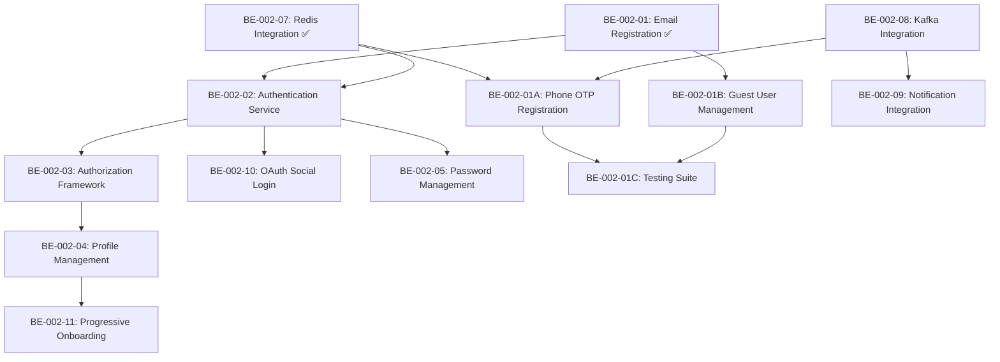

# Updated Epic 2 Implementation Plan - Restructured Stories

**Epic:** User Management Service  
**Total Story Points:** 58 (was 65)  
**Sprints:** 3 (optimized from 4)  
**Status:** Sprint 1 in progress  

## 📋 **Story Restructuring Summary**

### **BEFORE (Original Structure):**
- BE-002-01: Multi-Type User Registration (8 points) - **TOO BIG**
- 14 other stories covering various aspects

### **AFTER (Restructured):**
- BE-002-01: Basic Email Registration (3 points) ✅ **COMPLETED**
- BE-002-01A: Phone OTP Registration (5 points) 🆕 **NEW STORY**
- BE-002-01B: Guest User Management (3 points) 🆕 **NEW STORY**
- BE-002-01C: Registration Testing Suite (3 points) 🆕 **NEW STORY**

## 🎯 **Sprint Planning - Restructured**

### **Sprint 1 (Current) - Foundation & Core Registration**
**Total Points:** 16 | **Duration:** 2 weeks

| Story ID | Story Name | Points | Status | Dependencies |
|----------|------------|--------|--------|--------------|
| BE-002-01 | Basic Email Registration | 3 | ✅ **COMPLETED** | None |
| BE-002-07 | Redis Integration | 5 | ✅ **COMPLETED** | None |
| BE-002-08 | Kafka Integration | 5 | 🔄 **IN PROGRESS** | Redis |
| BE-002-01A | Phone OTP Registration | 5 | 📋 **PLANNED** | Kafka, Redis |

**Sprint 1 Goals:**
- ✅ Basic email registration working
- ✅ Redis caching and session management
- 🔄 Event-driven architecture with Kafka
- 📋 Phone registration with OTP verification

### **Sprint 2 - Authentication & Advanced Features**
**Total Points:** 19 | **Duration:** 2 weeks

| Story ID | Story Name | Points | Status | Dependencies |
|----------|------------|--------|--------|--------------|
| BE-002-02 | Authentication Service | 8 | 📋 **PLANNED** | BE-002-01, Redis |
| BE-002-09 | Notification Integration | 5 | 📋 **PLANNED** | Kafka |
| BE-002-01B | Guest User Management | 3 | 📋 **PLANNED** | BE-002-01 |
| BE-002-03 | Authorization Framework | 5 | 📋 **PLANNED** | BE-002-02 |

**Sprint 2 Goals:**
- JWT authentication with login/logout
- SMS and email notifications
- Guest user functionality
- Role-based authorization

### **Sprint 3 - Social Login & Production Readiness**
**Total Points:** 23 | **Duration:** 2 weeks

| Story ID | Story Name | Points | Status | Dependencies |
|----------|------------|--------|--------|--------------|
| BE-002-10 | OAuth Social Login | 8 | 📋 **PLANNED** | BE-002-02 |
| BE-002-04 | Profile Management | 5 | 📋 **PLANNED** | BE-002-03 |
| BE-002-05 | Password Management | 3 | 📋 **PLANNED** | BE-002-02 |
| BE-002-01C | Registration Testing Suite | 3 | 📋 **PLANNED** | BE-002-01A, BE-002-01B |
| BE-002-11 | Progressive Onboarding | 8 | 📋 **PLANNED** | BE-002-04 |

**Sprint 3 Goals:**
- Google, Facebook, Instagram, Twitter OAuth
- Complete profile management
- Password reset and change
- Comprehensive test coverage
- Progressive user onboarding

## 🔄 **Story Dependencies Map**

## 📊 **Benefits of Restructuring**

### **1. Smaller, Focused Stories**
- **Before:** 8-point mega-story covering 4 different features
- **After:** 3-5 point stories, each with single responsibility

### **2. Better Parallel Development**
- **Sprint 1:** Email registration + Infrastructure (Redis/Kafka)
- **Sprint 2:** Authentication + Guest users (can work in parallel)
- **Sprint 3:** Social login + Testing (independent streams)

### **3. Incremental Value Delivery**
- ✅ **Week 1:** Basic email registration working
- 🔄 **Week 2:** Phone registration + event publishing
- 📋 **Week 3:** Full authentication system
- 📋 **Week 4:** Guest users + authorization

### **4. Reduced Risk**
- Each story delivers working functionality
- Easier to test and validate
- Faster feedback cycles
- Better estimation accuracy

## 🎯 **Current Status & Next Actions**

### **✅ COMPLETED (Sprint 1)**
1. **BE-002-01**: Basic Email Registration
   - Email + password registration working
   - Database persistence with PostgreSQL
   - JWT token generation
   - Password validation and BCrypt encoding

2. **BE-002-07**: Redis Integration
   - Session management
   - Token blacklisting
   - User profile caching
   - Health indicators

### **🔄 IN PROGRESS (Sprint 1)**
3. **BE-002-08**: Kafka Integration
   - Event schemas defined
   - Producer configuration
   - Consumer setup needed
   - Health indicators needed

### **📋 NEXT UP (Sprint 1)**
4. **BE-002-01A**: Phone OTP Registration
   - OTP generation service
   - SMS integration (depends on BE-002-09)
   - Phone validation
   - Rate limiting

## 🚀 **Immediate Action Items**

### **This Week:**
1. **Complete BE-002-08** (Kafka Integration)
2. **Start BE-002-01A** (Phone OTP Registration)
3. **Plan BE-002-09** (Notification Integration) for Sprint 2

### **Next Week:**
1. **Complete BE-002-01A** (Phone OTP Registration)
2. **Sprint 1 Review** and retrospective
3. **Sprint 2 Planning** with updated estimates

## 📈 **Success Metrics**

### **Sprint 1 Success Criteria:**
- [x] Email registration: < 500ms response time
- [x] Redis integration: < 100ms cache operations
- [ ] Kafka integration: Event publishing < 50ms
- [ ] Phone OTP: OTP generation < 200ms

### **Overall Epic Success:**
- All registration methods working (email, phone, social, guest)
- Authentication system with JWT
- Event-driven architecture
- Comprehensive test coverage (>90%)
- Production-ready monitoring and health checks

## 🔧 **Technical Debt & Improvements**

### **Addressed by Restructuring:**
- ✅ Removed monolithic story structure
- ✅ Clear separation of concerns
- ✅ Better dependency management
- ✅ Incremental testing approach

### **Still to Address:**
- API documentation (Swagger/OpenAPI)
- Performance monitoring
- Security audit
- Load testing

---

**Last Updated:** 2025-08-02  
**Next Review:** After Sprint 1 completion  
**Team:** Backend Development Team
