# User Journey Flows Documentation

## User Journey Flowchart (Mermaid)

Below is the complete user journey flowchart for the Tea & Snacks Delivery platform, visualized using Mermaid syntax. This diagram provides a high-level overview of all possible user paths, from app launch through authentication, registration, preference setup, and ongoing usage.

```mermaid
flowchart TD
    A["User Opens App"] --> B{"User Logged In?"}
    B -->|Yes| C["Home Screen"]
    B -->|No| D["Welcome Screen"]
    D --> E["Login/Signup Options"]
    E --> F["Phone Number Login"]
    E --> G["Email Login"]
    E --> H["Social Login"]
    E --> I["Continue as Guest"]
    F --> J["Enter Phone Number"]
    J --> K["Send OTP"]
    K --> L["Enter OTP"]
    L --> M{"OTP Valid?"}
    M -->|No| N["Show Error"]
    N --> L
    M -->|Yes| O{"New User?"}
    O -->|Yes| P["Create Profile"]
    O -->|No| Q["Check Preferences"]
    G --> R["Enter Email/Password"]
    R --> S{"Credentials Valid?"}
    S -->|No| T["Show Error Message"]
    T --> R
    S -->|Yes| Q
    H --> U["Google Login"]
    H --> V["Facebook Login"]
    H --> W["Apple Login"]
    U --> X["OAuth Flow"]
    V --> X
    W --> X
    X --> Y{"OAuth Success?"}
    Y -->|No| Z["Show OAuth Error"]
    Z --> E
    Y -->|Yes| O
    P --> AA["Enter Name"]
    AA --> BB["Enter Email #40;Optional#41;"]
    BB --> CC["Set Primary Location"]
    CC --> DD["Profile Created"]
    DD --> EE["Start Preference Setup"]
    EE --> FF["Food Preferences"]
    FF --> GG["Select Cuisines"]
    GG --> HH["Indian, Chinese, Italian, etc."]
    HH --> II["Dietary Restrictions"]
    II --> JJ["Vegetarian, Vegan, Jain, etc."]
    JJ --> KK["Spice Level Preference"]
    KK --> LL["Mild, Medium, Spicy, Extra Spicy"]
    LL --> MM["Delivery Preferences"]
    MM --> NN["Preferred Delivery Time"]
    NN --> OO["ASAP, 30min, 1hr, Schedule"]
    OO --> PP["Budget Range"]
    PP --> QQ["₹0-200, ₹200-500, ₹500#43;"]
    QQ --> RR["Delivery Distance"]
    RR --> SS["1km, 3km, 5km, 10km#43;"]
    SS --> TT["Notification Preferences"]
    TT --> UU["Order Updates"]
    UU --> VV["Offers #38; Discounts"]
    VV --> WW["New Restaurant Alerts"]
    WW --> XX["Push, SMS, Email, WhatsApp"]
    XX --> YY["Payment Preferences"]
    YY --> ZZ["Default Payment Method"]
    ZZ --> AAA["Card, UPI, Wallet, COD"]
    AAA --> BBB["Save Payment Info"]
    BBB --> CCC["Auto-apply Offers"]
    CCC --> DDD["Location Preferences"]
    DDD --> EEE["Add Work Address"]
    EEE --> FFF["Add Home Address"]
    FFF --> GGG["Add Other Addresses"]
    GGG --> HHH["Set Default Address"]
    HHH --> III["Accessibility Preferences"]
    III --> JJJ["Language Selection"]
    JJJ --> KKK["Hindi, English, Regional"]
    KKK --> LLL["Font Size"]
    LLL --> MMM["Voice Navigation"]
    MMM --> NNN["Color Contrast"]
    NNN --> OOO["Marketing Preferences"]
    OOO --> PPP["Personalized Recommendations"]
    PPP --> QQQ["Location-based Offers"]
    QQQ --> RRR["Birthday #38; Anniversary Deals"]
    RRR --> SSS["Share Data for Better Experience"]
    SSS --> TTT["Review #38; Confirm Preferences"]
    TTT --> UUU{"Skip Remaining?"}
    UUU -->|Yes| VVV["Save Current Preferences"]
    UUU -->|No| WWW["Complete All Preferences"]
    WWW --> VVV
    VVV --> XXX["Preference Setup Complete"]
    Q --> YYY{"Preferences Complete?"}
    YYY -->|No| ZZZ["Show Preference Prompt"]
    ZZZ --> AAA1["Complete Missing Preferences"]
    AAA1 --> FF
    YYY -->|Yes| BBB1["Login Success"]
    XXX --> BBB1
    BBB1 --> CCC1["Set Session Token"]
    CCC1 --> DDD1["Load Personalized Content"]
    DDD1 --> C
    I --> EEE1["Limited Access Mode"]
    EEE1 --> FFF1["Browse Restaurants"]
    FFF1 --> GGG1{"Want to Order?"}
    GGG1 -->|Yes| HHH1["Prompt Login"]
    HHH1 --> E
    GGG1 -->|No| FFF1
    C --> III1["Personalized Home Screen"]
    III1 --> JJJ1["Recommended Restaurants"]
    III1 --> KKK1["Cuisine-based Suggestions"]
    III1 --> LLL1["Location-based Offers"]
    III1 --> MMM1["Order History"]
    III1 --> NNN1["Manage Preferences"]
    III1 --> OOO1["Logout"]
    NNN1 --> PPP1["Update Food Preferences"]
    NNN1 --> QQQ1["Update Delivery Preferences"]
    NNN1 --> RRR1["Update Notification Settings"]
    NNN1 --> SSS1["Update Payment Methods"]
    NNN1 --> TTT1["Update Addresses"]
    OOO1 --> UUU1["Clear Session"]
    UUU1 --> D
    style A fill:#ff6b6b
    style C fill:#51cf66
    style BBB1 fill:#51cf66
    style XXX fill:#51cf66
    style N fill:#ffd43b
    style T fill:#ffd43b
    style Z fill:#ffd43b
    style FF fill:#74c0fc
    style MM fill:#74c0fc
    style TT fill:#74c0fc
    style YY fill:#74c0fc
    style DDD fill:#74c0fc
    style III fill:#74c0fc
    style OOO fill:#74c0fc
```

---

## Overview
This document provides a comprehensive, human-readable description of all user journey flows in the Tea & Snacks Delivery platform, based on the detailed flowchart provided. Each flow is documented with clear descriptions, user actions, system responses, and backend story coverage.

## Table of Contents
1. [Initial App Experience](#initial-app-experience)
2. [Authentication Flows](#authentication-flows)
3. [Registration Flows](#registration-flows)
4. [Profile Creation Flow](#profile-creation-flow)
5. [Preference Setup Flow](#preference-setup-flow)
6. [Home Screen Experience](#home-screen-experience)
7. [Preference Management](#preference-management)
8. [Guest User Experience](#guest-user-experience)
9. [Error Handling Flows](#error-handling-flows)

---

## Initial App Experience

### Flow: App Launch to Welcome Screen
**Path**: User Opens App → User Logged In? → Welcome Screen

#### User Actions:
1. **User Opens App**: User launches the mobile/web application
2. **System Check**: App checks if user has an active session
3. **Welcome Screen Display**: If no active session, app shows welcome screen

#### System Response:
- Display welcome screen with login/signup options
- Show app branding and value proposition
- Present multiple authentication options

#### Backend Coverage:
- **BE-002-02**: Session validation and management
- **BE-002-06**: API Gateway routing and security

---

## Authentication Flows

### Flow 1: Phone Number Authentication
**Path**: Phone Number Login → Enter Phone Number → Send OTP → Enter OTP → OTP Validation

#### User Actions:
1. **Select Phone Login**: User chooses phone number authentication option
2. **Enter Phone Number**: User inputs their mobile number
3. **Request OTP**: User taps "Send OTP" button
4. **Enter OTP**: User receives and enters the 6-digit OTP
5. **Submit OTP**: User submits the OTP for verification

#### System Response:
- Validate phone number format
- Generate and send OTP via SMS
- Validate OTP against stored value
- Check if user exists in system
- Create session if authentication successful

#### Error Handling:
- **Invalid OTP**: Show error message, allow retry
- **Expired OTP**: Prompt to request new OTP
- **Invalid Phone**: Show format error

#### Backend Coverage:
- **BE-002-09**: OTP generation and SMS delivery
- **BE-002-01**: Phone number validation and user lookup
- **BE-002-02**: Session creation and JWT token generation

### Flow 2: Email Authentication
**Path**: Email Login → Enter Email/Password → Credentials Validation

#### User Actions:
1. **Select Email Login**: User chooses email authentication option
2. **Enter Credentials**: User inputs email and password
3. **Submit Login**: User submits credentials for verification

#### System Response:
- Validate email format
- Verify password against stored hash
- Check if user account exists and is active
- Create session if authentication successful

#### Error Handling:
- **Invalid Credentials**: Show error message, allow retry
- **Account Locked**: Show account status message
- **Invalid Email**: Show format error

#### Backend Coverage:
- **BE-002-01**: Email validation and user lookup
- **BE-002-02**: Password verification and session management
- **BE-002-03**: Account status validation

### Flow 3: Social Login Authentication
**Path**: Social Login → Provider Selection → OAuth Flow → OAuth Validation

#### User Actions:
1. **Select Social Login**: User chooses social authentication option
2. **Choose Provider**: User selects Google, Facebook, or Apple
3. **OAuth Redirect**: User is redirected to provider's authentication page
4. **Provider Authentication**: User authenticates with the selected provider
5. **Return to App**: User is redirected back to the app

#### System Response:
- Initiate OAuth flow with selected provider
- Validate OAuth token with provider
- Extract user information from OAuth response
- Check if user exists in system
- Create session if authentication successful

#### Error Handling:
- **OAuth Failure**: Show error message, return to login options
- **Provider Unavailable**: Show fallback message
- **Token Expired**: Prompt to re-authenticate

#### Backend Coverage:
- **BE-002-10**: OAuth integration with multiple providers
- **BE-002-01**: Social user profile mapping
- **BE-002-02**: Session creation for social users

---

## Registration Flows

### Flow 1: New User Registration via Phone
**Path**: OTP Validation → New User Check → Create Profile

#### User Actions:
1. **Complete OTP Verification**: User successfully validates OTP
2. **System Check**: System determines this is a new user
3. **Profile Creation**: User is prompted to create their profile

#### System Response:
- Create new user account
- Generate unique user ID
- Initialize user profile
- Redirect to profile creation flow

#### Backend Coverage:
- **BE-002-01**: New user account creation
- **BE-002-04**: Profile initialization

### Flow 2: New User Registration via Email
**Path**: Credentials Validation → New User Check → Create Profile

#### User Actions:
1. **Complete Email Verification**: User successfully logs in with email
2. **System Check**: System determines this is a new user
3. **Profile Creation**: User is prompted to create their profile

#### System Response:
- Create new user account
- Generate unique user ID
- Initialize user profile
- Redirect to profile creation flow

#### Backend Coverage:
- **BE-002-01**: New user account creation
- **BE-002-04**: Profile initialization

### Flow 3: New User Registration via Social
**Path**: OAuth Validation → New User Check → Create Profile

#### User Actions:
1. **Complete OAuth Flow**: User successfully authenticates with social provider
2. **System Check**: System determines this is a new user
3. **Profile Creation**: User is prompted to create their profile

#### System Response:
- Create new user account using social profile data
- Generate unique user ID
- Initialize user profile with social information
- Redirect to profile creation flow

#### Backend Coverage:
- **BE-002-10**: Social profile data extraction
- **BE-002-01**: Social user account creation
- **BE-002-04**: Profile initialization with social data

---

## Profile Creation Flow

### Flow: Basic Profile Setup
**Path**: Create Profile → Enter Name → Enter Email → Set Primary Location → Profile Created

#### User Actions:
1. **Enter Name**: User provides their full name
2. **Enter Email** (Optional): User provides email address if not already provided
3. **Set Primary Location**: User sets their primary delivery address
4. **Complete Profile**: User submits profile information

#### System Response:
- Validate user input
- Save profile information to database
- Generate profile completion event
- Redirect to preference setup flow

#### Backend Coverage:
- **BE-002-04**: Profile data validation and storage
- **BE-002-08**: Profile creation event publishing

---

## Preference Setup Flow

### Flow: Comprehensive Preference Collection
**Path**: Start Preference Setup → Food Preferences → Delivery Preferences → Notification Preferences → Payment Preferences → Location Preferences → Accessibility Preferences → Marketing Preferences → Review & Confirm

#### Phase 1: Food Preferences
**Path**: Food Preferences → Select Cuisines → Dietary Restrictions → Spice Level Preference

##### User Actions:
1. **Select Cuisines**: User chooses preferred cuisines (Indian, Chinese, Italian, etc.)
2. **Dietary Restrictions**: User selects dietary preferences (Vegetarian, Vegan, Jain, etc.)
3. **Spice Level**: User chooses preferred spice level (Mild, Medium, Spicy, Extra Spicy)

##### System Response:
- Save food preferences
- Calculate preference completion percentage
- Prepare next preference category

#### Phase 2: Delivery Preferences
**Path**: Delivery Preferences → Preferred Delivery Time → Budget Range → Delivery Distance

##### User Actions:
1. **Delivery Time**: User selects preferred delivery time (ASAP, 30min, 1hr, Schedule)
2. **Budget Range**: User chooses budget range (₹0-200, ₹200-500, ₹500+)
3. **Delivery Distance**: User sets maximum delivery distance (1km, 3km, 5km, 10km+)

##### System Response:
- Save delivery preferences
- Update completion percentage
- Prepare next preference category

#### Phase 3: Notification Preferences
**Path**: Notification Preferences → Order Updates → Offers & Discounts → New Restaurant Alerts → Communication Channels

##### User Actions:
1. **Order Updates**: User enables/disables order status notifications
2. **Offers & Discounts**: User enables/disables promotional notifications
3. **Restaurant Alerts**: User enables/disables new restaurant notifications
4. **Communication Channels**: User selects preferred channels (Push, SMS, Email, WhatsApp)

##### System Response:
- Save notification preferences
- Update completion percentage
- Prepare next preference category

#### Phase 4: Payment Preferences
**Path**: Payment Preferences → Default Payment Method → Save Payment Info → Auto-apply Offers

##### User Actions:
1. **Payment Method**: User selects default payment method (Card, UPI, Wallet, COD)
2. **Save Payment Info**: User chooses whether to save payment information
3. **Auto-apply Offers**: User enables/disables automatic offer application

##### System Response:
- Save payment preferences
- Update completion percentage
- Prepare next preference category

#### Phase 5: Location Preferences
**Path**: Location Preferences → Add Work Address → Add Home Address → Add Other Addresses → Set Default Address

##### User Actions:
1. **Work Address**: User adds their work location
2. **Home Address**: User adds their home location
3. **Other Addresses**: User adds additional delivery addresses
4. **Default Address**: User sets their primary delivery address

##### System Response:
- Save location preferences
- Update completion percentage
- Prepare next preference category

#### Phase 6: Accessibility Preferences
**Path**: Accessibility Preferences → Language Selection → Font Size → Voice Navigation → Color Contrast

##### User Actions:
1. **Language**: User selects preferred language (Hindi, English, Regional)
2. **Font Size**: User adjusts text size for readability
3. **Voice Navigation**: User enables/disables voice navigation
4. **Color Contrast**: User adjusts color contrast settings

##### System Response:
- Save accessibility preferences
- Update completion percentage
- Prepare next preference category

#### Phase 7: Marketing Preferences
**Path**: Marketing Preferences → Personalized Recommendations → Location-based Offers → Birthday & Anniversary Deals → Share Data for Better Experience

##### User Actions:
1. **Personalized Recommendations**: User enables/disables personalized suggestions
2. **Location-based Offers**: User enables/disables location-based promotions
3. **Birthday & Anniversary Deals**: User enables/disables special occasion offers
4. **Data Sharing**: User consents to data sharing for improved experience

##### System Response:
- Save marketing preferences
- Update completion percentage
- Prepare final review

#### Phase 8: Review & Confirm
**Path**: Review & Confirm Preferences → Skip Remaining → Save Preferences → Preference Setup Complete

##### User Actions:
1. **Review Preferences**: User reviews all collected preference data
2. **Skip Remaining**: User chooses to skip remaining preferences or complete all
3. **Confirm Preferences**: User confirms and saves all preferences

##### System Response:
- Save all preference data
- Calculate final completion percentage
- Generate preference completion event
- Redirect to home screen

#### Backend Coverage:
- **BE-002-11**: All preference categories and data collection
- **BE-002-08**: Preference event publishing for other services

---

## Home Screen Experience

### Flow: Personalized Home Screen
**Path**: Login Success → Set Session Token → Load Personalized Content → Home Screen

#### User Actions:
1. **Successful Authentication**: User completes any authentication method
2. **Session Creation**: System creates user session
3. **Content Loading**: System loads personalized content based on preferences

#### System Response:
- Generate JWT session token
- Load user profile and preferences
- Fetch personalized recommendations
- Display home screen with personalized content

#### Home Screen Features:
- **Recommended Restaurants**: Based on food preferences and order history
- **Cuisine-based Suggestions**: Personalized cuisine recommendations
- **Location-based Offers**: Promotions based on user location
- **Order History**: Previous orders and reorder options
- **Preference Management**: Quick access to update preferences
- **Logout Option**: Session termination

#### Backend Coverage:
- **BE-002-02**: Session token management
- **BE-002-04**: Profile and preference data retrieval
- **BE-002-11**: Preference-based content personalization

---

## Preference Management

### Flow: Update User Preferences
**Path**: Manage Preferences → Update Food Preferences → Update Delivery Preferences → Update Notification Settings → Update Payment Methods → Update Addresses

#### User Actions:
1. **Access Preference Management**: User navigates to preference settings
2. **Select Category**: User chooses which preference category to update
3. **Modify Preferences**: User updates specific preference values
4. **Save Changes**: User confirms and saves preference updates

#### System Response:
- Validate updated preference data
- Save changes to database
- Update completion percentage
- Publish preference change events
- Refresh personalized content

#### Backend Coverage:
- **BE-002-11**: Preference update operations
- **BE-002-08**: Preference change event publishing

---

## Guest User Experience

### Flow: Limited Access Mode
**Path**: Continue as Guest → Limited Access Mode → Browse Restaurants → Want to Order? → Prompt Login

#### User Actions:
1. **Choose Guest Mode**: User selects "Continue as Guest" option
2. **Browse Content**: User can browse restaurants and menus
3. **Attempt Order**: User tries to place an order
4. **Login Prompt**: System prompts user to create account or login

#### System Response:
- Create temporary guest session
- Allow limited browsing functionality
- Block order placement for guest users
- Prompt for account creation when order is attempted

#### Backend Coverage:
- **BE-002-01**: Guest user session management
- **BE-002-06**: API Gateway guest access control

---

## Error Handling Flows

### Flow 1: OTP Error Handling
**Path**: OTP Validation → Invalid OTP → Show Error → Retry OTP Entry

#### User Actions:
1. **Submit Invalid OTP**: User enters incorrect OTP
2. **View Error**: System displays error message
3. **Retry**: User re-enters OTP

#### System Response:
- Validate OTP against stored value
- Display appropriate error message
- Allow user to retry OTP entry
- Track failed attempts for security

#### Backend Coverage:
- **BE-002-09**: OTP validation and error handling
- **BE-002-02**: Security tracking and rate limiting

### Flow 2: Login Error Handling
**Path**: Credentials Validation → Invalid Credentials → Show Error Message → Retry Login

#### User Actions:
1. **Submit Invalid Credentials**: User enters incorrect email/password
2. **View Error**: System displays error message
3. **Retry**: User re-enters credentials

#### System Response:
- Validate credentials against stored data
- Display appropriate error message
- Allow user to retry login
- Track failed attempts for security

#### Backend Coverage:
- **BE-002-01**: Credential validation and error handling
- **BE-002-02**: Security tracking and account protection

### Flow 3: OAuth Error Handling
**Path**: OAuth Flow → OAuth Failure → Show OAuth Error → Return to Login Options

#### User Actions:
1. **OAuth Authentication Fails**: OAuth provider returns error
2. **View Error**: System displays OAuth error message
3. **Return to Options**: User returns to authentication options

#### System Response:
- Handle OAuth provider errors
- Display user-friendly error message
- Return user to authentication selection
- Log error for debugging

#### Backend Coverage:
- **BE-002-10**: OAuth error handling and fallback
- **BE-002-06**: API Gateway error routing

### Flow 4: Preference Validation Error Handling
**Path**: Preference Submission → Incomplete Preferences → Show Preference Prompt → Complete Missing Preferences

#### User Actions:
1. **Submit Incomplete Preferences**: User submits preferences with missing data
2. **View Prompt**: System shows which preferences are missing
3. **Complete Missing Data**: User fills in required preference fields

#### System Response:
- Validate preference completeness
- Identify missing required fields
- Display specific prompts for missing data
- Guide user through completion

#### Backend Coverage:
- **BE-002-11**: Preference validation and completion tracking

---

## Session Management

### Flow: Logout Process
**Path**: Logout → Clear Session → Return to Welcome Screen

#### User Actions:
1. **Initiate Logout**: User selects logout option
2. **Confirm Logout**: User confirms logout action

#### System Response:
- Invalidate JWT session token
- Clear user session data from Redis
- Remove user authentication state
- Redirect to welcome screen

#### Backend Coverage:
- **BE-002-02**: Session invalidation and cleanup
- **BE-002-07**: Redis session data removal

---

## Integration Points

### Event Publishing
Throughout the user journey, the system publishes events to Kafka for other services:

1. **User Registration Events**: Notify other services of new user creation
2. **Profile Update Events**: Inform services of profile changes
3. **Preference Change Events**: Update recommendation and personalization services
4. **Session Events**: Track user activity and engagement

### External Service Integration
1. **SMS Service**: OTP delivery via Gupshup
2. **Email Service**: Notifications via SendGrid
3. **OAuth Providers**: Google, Facebook, Apple authentication
4. **Payment Gateways**: Payment method validation

---

## Success Metrics

### User Experience Metrics
- **Registration Completion Rate**: Percentage of users who complete registration
- **Preference Setup Completion**: Percentage of users who complete preference setup
- **Session Duration**: Average time users spend in the app
- **Return User Rate**: Percentage of users who return after first session

### Technical Metrics
- **Authentication Success Rate**: Percentage of successful logins
- **OTP Delivery Success**: Percentage of successful OTP deliveries
- **API Response Time**: Average response time for key APIs
- **Error Rate**: Percentage of failed requests

---

## Conclusion

This comprehensive user journey documentation provides a complete reference for understanding all user flows in the Tea & Snacks Delivery platform. Each flow is supported by the corresponding backend stories in Epic 2, ensuring complete coverage of user requirements and system functionality.

The documentation serves as a reference for:
- **Development Teams**: Understanding user flows and system requirements
- **Testing Teams**: Creating comprehensive test scenarios
- **Product Teams**: Validating feature completeness
- **Support Teams**: Understanding user interactions and troubleshooting 